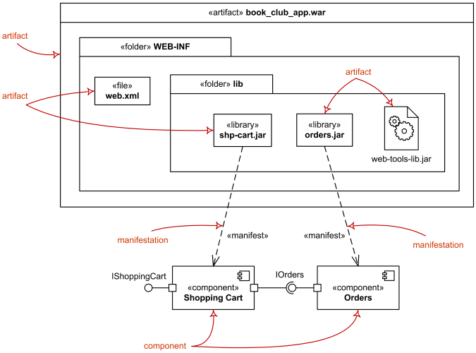

[返回首页](../README.md)

# <a name="top">我对Scrum的思考</a>

## 目录
- [大问号-我们为什么使用Scrum?](#h1)
- [软件开发过程是什么样的？](#h2)
  - [重量级方法](#h2.1)
    - [非技术性文档](#h2.1.1)
    - [UML](#h2.1.2)
      - [概要](#h2.1.2.1)
      - [结构视图(Structure Diagrams)](#h2.1.2.2)
      - [行为视图(Behavior Diagrams)](#h2.1.2.3)
  - [我们究竟会碰到哪些问题?](#h2.2)
- [为什么会产生这些问题?](#h3)
  - [敏捷方法之后总出问题? 这是一个伪命题!](#h3.1)
  - [从小故事开始：给我一杯水](#h3.2)
  - [什么是需求分析？](#h3.3)
  - [怎么才算正确的需求分析？](#h3.4)
    - [极端假设](#h3.4.1)
- [Scrum到底解决哪些问题？](#h4)
  - [再来几个小故事](#h4.1)
    - [我们开房学习](#h4.1.1)
    - [Make it warmer](#h4.1.2)
- [Scrum中是怎么解决这些问题?它为什么能够解决这些问题？](#h5)
  - [计划会议](#5.1)
    - [商业价值、重要性之头脑风暴](#h5.1.1)
    - [用户故事大小之头脑风暴](#h5.1.2)

## <a name="h1">大问号-我们为什么使用敏捷方法?</a>[&#x2191;top](#top)

在我们这个时代，互联网技术的发展以可怕的速度改变着我们的世界。软件开发领域的前辈们，也都在尝试和引领各式各样的软件开发方法论。

如果你愿意花5分钟时间，用Google搜索Scrum相关的资料，你就会发现Scrum只是众多敏捷方法中的一种，而敏捷方法的族系是大的让人怯步，你不大可能把所有方法都试一遍。

如果说只是想试试Scrum，或许真的不需要去理解什么历史背景，你按书本中的操作方法一步一步教条地执行下去就可以了。
这也是最节省精力和时间的办法。

我也相信你身边很有可能有人站出来说： “我们要站在巨人的肩膀上，只需要参考前人的经验就行了，不用想那么多。”

但问题是在没有任何参照的情况下，你怎么才能知道自己有没有偏离正确的方向？

我知道我自己是做不到，所以我在一个又一个断断续续地的阶段里，去无数次思考这样一个问题。

> 我们为什么使用敏捷方法?

是的，问题很简单，但回答它似乎没有那么简单。

举一个例子。

“我们为什么坐飞机？除了飞机我们可是还有高铁、动车组、客轮等等交通工具的呀!？”

对这样的问题你可能都不费任何脑细胞: 

“因为飞机快呀!”

而且会很激动，心里想为什么会问这么傻逼的问题。

就这么一个连幼儿园小朋友都能回答的问题，有什么值得分析的呢？

那我就要问: 

“你怎么定义的快？什么样的速度算快？600km/h算快吗？那800km/h呢？多快算快？”

其实这个问题的关键不是飞机用什么样的速度飞行，而是我们心里边对飞机、高铁、动车组、客轮等交通工具的速度潜移默化形成的概念。

对于我们人类，除了本能，任何一类信息都是经过大脑加工之后被存储下来，方便日后提取使用。

之后，或许是通过重复，或许是通过进一步逻辑处理，最后一定会以更简单的形态沉淀下来。

一部分变成了经验，另一部分变成了直觉。

这样面对问题的时候，我们就不必进行太多的信息处理和逻辑推演，要不然就会把大脑转冒烟了。

这是人类大脑经过漫长的岁月进化而来的自我保护能力。

我们大脑的这种机能，会使我们在对事物的分析中失去关注背景和条件的能力。

有的时候为了正确地做事情，我们只有把自己打回原形，主动去和这种机能对抗，才能找到正确的因果关系。

工作这些年，一直在不同的开发团队以不同形式挣扎，唯一期盼的就是希望团队对所做的事情有着统一的认知。
由于每个人的认知框架是从幼儿时期开始就以不同形式一点一滴搭建起来的，所以这种期盼的确是个幻想。
但我相信在我们内心深处都是虚心的、向上的、明智的，愿意修正完善自己的认知。

我认为回答这个问题，至少要先回答下面这些问题。

- 软件开发过程是什么样的？
- 我们究竟会碰到哪些问题？
- 为什么会产生这些问题？
- Scrum到底解决哪些问题？
- Scrum中是怎么解决这些问题?
- Scrum为什么能够解决这些问题?

## <a name="h2">软件开发过程是什么样的？</a>[&#x2191;top](#top)

前面提到敏捷方法，事实上它是很多具体方法的集合。
如果你想了解一下是怎么个很多法，请看下面关于Agile那个链接里列举的方法。
如果再把范围扩展到整个软件开发过程方法论的话，具体方法的数目就不再是屈指可数了，你也可以到下面的链接里边扫一眼。

1. [Software development process](https://en.wikipedia.org/wiki/Software_development_process)
2. [Systems development life cycle](https://en.wikipedia.org/wiki/Systems_development_life_cycle)
3. [Agile software development](https://en.wikipedia.org/wiki/Agile_software_development)

如果按阶段来讲，每个阶段都会有细分方法。

仅仅测试环节就会有路径测试、单元测试、系统测试、集成测试、黑盒测试、白盒测试、性能测试等等...

它们在实施层面又可以分为手动测试和自动化测试。加上开发阶段、运维阶段就更多了。

>软件工程是一项庞大的系统工程。

但是，大致可以分为两类。**重量级方法**和**轻量级方法**。

对70后、80后而言，早些年参加工作接触的不管叫瀑布流方式开发还是别的什么，虽说叫法和具体实施上会有很大的差异，但基本思路都是重量级方法的思路。

90后绝大多数人可能完全没有接触重量级方法的机会，遍地都是互联网企业，参加工作的第一个星期，“领导”告知“我们公司是搞敏捷开发的”，把人弄的一头雾水。然后跌跌撞撞工作几个月，熟悉了团队实施的那个所谓的敏捷开发。

然后心里想：

>哦，原来这个叫敏捷方法!!!不过如此嘛~~

但真是如此吗？

不妨咱们先看看重量级方法是什么样的。

### <a name="h2.1">重量级方法</a>[&#x2191;top](#top)
>软件工程是以技术人员的劳动作为核心的生产活动

先推荐一本书(<small>感谢[未舟](http://zwiter.com/)在恰当的时间给我推荐这本书</small>):[《大象：Thinking in UML(第2版)》](https://book.douban.com/subject/10549583/)

这本书对我理解重量级方法帮助很大，我接下来要结合我的理解和实际问题场景提炼关键点。

UML是软件工程中最为直接高效的文档形式，尤其是面向技术人员，可以精准地指导具体的技术实现。
但实际项目过程中，由于很多需要解决的问题不都是技术问题，所以软件工程中很大比例的工作人员是非技术人员。

如果你了解过RUP，那你一定知道Rational公司推出的RUP方法，它也是众多重量级方法中最拔尖的一个。
这个公司的UML工具产品Rational Rose，基本上也可以秒杀市面上所有的UML工具。

>[RUP (Rational Unified Process](https://en.wikipedia.org/wiki/Rational_Unified_Process))

早些年参与工作的工程师们接触过的形形色色的方法，其实你都可以理解为是类RUP的方法。

我想引用几个这本书里边提及的的部分“所谓的”非技术性文档，结合着我自己收集的UML视图，向大家呈现这种重量级方法。

它们可能真的会比较无聊，阅览它们甚至会非常难受，但你不要以为自己错了，它们本来就是那样的，错的不是你。

幸运的是这篇文章不是讲重量级方法，你只需要通过快速扫过感受一下它们在工程中的意义就足够了。

图例可能和你正在使用的Visio、Eclipse等UML工具有些差异，但不要紧，它们作用是一样的。

#### <a name="h2.1.1">非技术性文档</a>[&#x2191;top](#top)

##### 涉及到交互的需求文档
这种大多数人都见过，需求文档中涉及到交互的部分。

自文章[《移动直播App：直播间功能需求文档》](http://www.kejik.com/article/149091.html)。

##### 涉众概要文档

##### 用例（自然人）
RUP中用例的概念比较宽泛，主要是指和系统/模块打交道的角色。
而这个角色有可能是自然人，也有可能是其他模块或者系统

##### 用例规约

##### 非功能性需求

##### 非功能性需求可靠性

##### 非功能性需求有效性

#### <a name="h2.1.2">UML</a>[&#x2191;top](#top)

##### <a name="h2.1.2.1">概要</a>[&#x2191;top](#top)

UML视图可以分为两大类

>结构视图(Structure Diagrams)，也叫静态视图(Static Diagrams)。
>行为视图(Behavior Diagrams)，也叫动态视图(Dynamic Diagrams)。

##### <a name="h2.1.2.2">结构视图(Structure Diagrams)</a>[&#x2191;top](#top)
###### 类图(Class Diagrams)

###### 对象图(Object Diagrams)

###### 包图(Package Diagrams)

###### 模型图(Model Diagrams)

###### 集成图(Composite Diagrams)

###### 组件图(Component Diagrams)

###### 实现图(Manifestation Diagrams)

###### 部署图(Deployment Diagrams)

###### 网络架构图(Network Architecture Diagrams)

###### 配置图(Profile Diagrams)

##### <a name="h2.1.2.3">行为视图(Behavior Diagrams)</a>[&#x2191;top](#top)
###### 用例图(UseCase Diagram)

###### 活动图(Activity Diagram)

###### 状态图(State Machine Diagram)

###### 交互图(Interaction Overview Diagram)

###### 序列图(Sequence Diagram)

###### 通信图(Communication Diagram)

###### 计时图(Timing Diagram)

### <a name="h2.2">我们究竟会碰到哪些问题?</a>[&#x2191;top](#top)

重量级方法可以覆盖工程的方方面面，保证滴水不漏。

只要那些担当工程各个阶段的负责人的能力和道德是符合要求的(这一点可以通过严格的招聘流程保证)，
只要严格遵守方法论的标准和要求，
就本应该可以达到预期的目标，并且结局本应该也是完美的。

然而，现实总是残酷的。

>1. 整个项目工期比预计要长。
>2. 投入的资源比预计要多。
>3. 客户揪着不符合自己预期的实现，一再推拖余款的支付，甚至可能会打官司。
>4. 领导也不满意。

互联网技术的爆发给这样的重量级方法增添了更多的变量。

>1. 变化太多、太快，导致需求不断地被修改。
>2. 随之，人力和时间很快成为新的瓶颈。

这些变量导致重量级方法在这个行业里一而再、再而三地酝酿出一个个悲剧。

然后企业或者团队慢慢消失在互联网的茫茫海平面下，最终走向死亡。

（到此，我觉得差不多也该推荐另一本书了 -- [《人月神话》](https://book.douban.com/subject/1102259/)）

在这样的背景下，各式各样的敏捷方法得到了我们的关注。Facebook在敏捷方法应用上的成功，成为了老式企业和团队满怀期待的救命稻草。
自从敏捷方法诞生后的几年时间里，无数的团队也是在各种程度上复制像Facebook这样成功企业的工程模式。
敏捷方法似乎成为了很时髦的流行语。如果说自己不是搞敏捷方法的，都不好意思说自己是互联网企业。 

实施了一段时间敏捷方法后，会出现一大堆新的问题。最有可能的解释就是，我们技术人员目前是搞敏捷方法，而敏捷方法本身就是提倡快速迭代方式的试错。
产品上积累越来越多的问题，最后导致生产力急剧下降，新功能的上线时间越来越被推迟。
最后产品只能推倒重来一遍，或者干脆死掉。

## <a name="h3">为什么会产生这些问题?</a>[&#x2191;top](#top)

### <a name="h3.1">敏捷方法之后总出问题? 这是一个伪命题!</a>[&#x2191;top](#top)

“用了敏捷方法”和“上线后总出问题”这两件事情，虽然是相关事件，但它们之间实际上不存在因果关系。

先看一下软件工程活动中的主要角色的职责。

#### 产品负责人
>职责上永远想更早的完成。因为想让用户能够尽快使用到新的Feature解决问题。

#### 研发工程师
>职责上永远想在质量上达到完美。因为当下对质量的对付，会变成将来寸步难行的原因。

这两个角色职责倾向上，永远都是对立的。 怎么找到中间的平衡取决于沟通，这没有任何标准答案。

实际软件开发过程中，相比产品负责人的工作内容就是沟通，研发工程师一般都不怎么喜欢沟通，也不喜欢吵架。

尽管这样，研发工程师都应该记得自己的职责是优先保证质量，有些让步和妥协是，你一旦做了，大家都得一块死。

### <a name="h3.2">从小故事开始：给我一杯水</a>[&#x2191;top](#top)
一次部门的产品会议上，一位产品负责人的同事说到：

>有人说给我一杯水，他不一定要喝，也有可能是想浇花。

在我为这类问题还没有找到很好的切入点的时候恰好听到了这个例子。

我想把这一句话按照我的理解再展开一下。

注意上下箭头中的Why和How。

这和前面提到的重量级方法和敏捷方法有什么关系？

太有关系了，而且是决定工程方法的实施能不能成功的关键。

因为面对问题

>切入的角度和方向，最终会决定你能得到的结论。没错，我特意使用了“方向”这个词。

前面我们已经看过重量级方法中是怎么样解决问题的。
重量级方法中，虽然说工程阶段就那么几个，但是从用户需求到产品交付这一条链是很长的。

有的角色整理需求，有的角色理解和分解需求，然后再往下交给技术人员，往往是技术团队的经理或者架构师这样的人。

同时，测试负责人会参与进来，整理测试用例，但因为测试的角度和目的不一样，所以会产生很多不同种类的测试用例。

而技术经理或者架构师角色的人，一般只承担设计者的职责，所以他们会把经过整理之后的需求分解成系统、模块等层面的需求。

由此会产生不同层次和深度上的用例设计视图，而单单是这个分解链条，有的时候也会很长。

因为分解下去信息量是几何级地增加，所以这种设计工作，又会被分解成更小粒度的任务，转交给对应的负责人，有可能是系统负责人，也有可能是模块负责人，也有可能是工程师团队的组长，或者工程师。
让他们进一步细化和完善更下一层的组件、包和类的需求。

最后由工程师把具体代码填充进去。

目前也有不少工具是只要设计工作做好了，工具可以自动生成对应的代码。例如Mule ESB或者ProFrame等。

测试工程师工作内容上会有单元测试、模块级别测试、系统级别测试，最后再来一遍联调测试。然后负责需求的各个角色们再验收一下。
在此之前，可能还会有alpha测试和beta测试、性能测试、AB测试等等。

而整个这种闭环链条上的每一个人，往往只做边界很清晰的事情，边界越清晰职责就越明确，随之的文档和规范就会越准确。
总之，负责每一小块任务的人，把自己分内的事情做好做精了就好。

出了问题，解决的思路也是如此。

1. 所谓高层、管理层主持会议，召集项目相关的人一起进行检讨。
2. 根据每项工作的量化标准找到责任人，并用现行的奖惩制度给予一定的惩罚。
3. 把问题出现处的流程，重新明确，使其更清晰一些。
4. 把问题出现处的规范、标准、文档再细化一遍。（由于这类文档内容都比较多，因此术语一定要保证非常概括，但又要非常精准。这是非常严谨周密的工作！）
5. 重申现行的量化标准，对它们进行必要的修改。
6. 重申现行的奖惩制度，对它们进行必要的修改。
7. 重申现行的培训流程，对它们进行必要的修改。
8. 选出工作中表现突出的“代表人物”，当着大家的面夸奖、鼓励，或者给予物质上的激励。
9. 所有的一切都要保证滴水不漏。
10. 偶尔进行打鸡血式的培训，确保每一个执行者的灵魂都得到必要的洗礼，让他们保持对这种工作方法的信仰，更加深入理解和相信它的理念。恨不得让每一个负责人们用生命对公司利益做出绝对的保证。（OPTION）

这得是多么虐心的心路历程!!!

久而久之，培育出了具备非常惊人推卸责任能力的一群人。因为一路走下来，文档和规范刚好特别全面，不知不觉中，大家也都已经非常认真的整理好了“出问题的时候不管我的事情”的证据，反正只要不是我这儿掉链子就行。

事实上，很多问题到最后才能够被发现实际上是需求分析、设计阶段就已经错了，但往往我们是没有办法在中途提出这一点，因为牵扯到太多人的利益，所以为了日后的和气共事，也只能大家一起错到底。最后没有实现预期的价值，也还好，因为法不责众嘛。

>我们是不是可以认为这种过程，就只能不断促使演化出，从它配套的制度上很自然就会有的，但我们并不希望看到的那种结果呢？这样的流程和方法到底出了什么问题呢？

为了回答这个问题，我在前面已经多次提到“需求”这个词汇。这是一个很微妙的词汇。

### <a name="h3.3">什么是需求分析？</a>[&#x2191;top](#top)

重量级方法中，闭环链条上的每一个节点与节点之间传递的信息，都是需求。

需求的性质和粒度取决于具体做的事情。这东西，有的时候也叫用例详情。

很显然，这种定义方式，和Scrum是不一样的。Scrum中需求应该是这样的。

需求永远都是用户和系统的边界上的事物（蓝色粗线）。

只要脱离边界靠近系统内部，不管是什么，统统都不是用户需求。

明确边界之后，我们要对用户需求进行分析，这个过程在Scrum中叫做对用户故事的分析。

### <a name="h3.4">怎么才算正确的需求分析？</a>[&#x2191;top](#top)

如果你对“给我一杯水”的例子印象深刻，我希望现在能够直接下一个定义:

>需求分析的本质是Why方向上的推理。它是分析“用户的真正动机”。

>但重量级方法一直试图在How的方向上解决问题。它永远在分析“设计上的缺陷”。

下面我还是想用通俗的方式呈现这一点。

需求本质上就是形形色色的，用户希望能够被解决的问题。

而面对这种问题，用户在解决这个问题的时候，不管是自己解决，还是别人帮解决，
> 在用户脑子里，在他自己的认知框架内，都会纯粹靠想象力创造出各种各样的“假想路径”。

就像“给我一杯水”中，尽管用户只是要擦鞋，仍然会以为自己需要水，并且仍然会认为对方接下来会在杯子中盛满水递给他。

在产品开发过程中，很多人都会强调用户预期，但别忘了这种假想路径也会以用户预期的形式表现出来。

而这种假想路径，这种用户预期，是需求分析变质走形的重灾区。

只有Why方向上的深入思考，才能解开这个魔咒。

### <a name="h3.4.1">极端假设</a>[&#x2191;top](#top)
“给我一杯水”再简单不过的一句话。

但如果试图在How方向上找答案，“杯子”和“水”自然就会变成强需求，你一定要解决的问题。

在How的方向上，不妨假设更极端的情况：

>1. 如果手边没有杯子和水怎么办？
>2. 那周围1km内有没有卖杯子和水的超市？
>3. 如果整个城市的所有超市杯子和水都断货了怎么办？
>4. 我们是不是应该自己造杯子，或者挖口井？

你能想象到在这些情况下，试图在How方向解决问题，结果会多恐怖吗？

你有可能一直在根本不需要做的事情上浪费时间。

如果先分析Why方向呢？

## <a name="h4">Scrum到底解决哪些问题？</a>[&#x2191;top](#top)

到此我们可以回答这个问题。

对我们为什么使用敏捷方法也有一点点推论了。

>敏捷方法最有价值的地方是解决了重量级方法中的思考方向的问题，需求的问题。

### <a name="h4.1">再来几个小故事</a>[&#x2191;top](#top)

为了加强印象，我想再举两个例子。

#### <a name="h4.1.1">我们开房学习</a>[&#x2191;top](#top)

一个老头儿在学校附近开宾馆，发现学生都是成对儿地过来开房。
有一天，实在是好奇就问他们你们开房都过来做什么？
于是，学生们就告诉他：学习。
然后老头费了几个星期的时间，把宾馆所有房间重新装修了一遍，把房间里的床和沙发换成了书架和书桌等。弄得氛围特别棒。

大家都是成年人，结果可想而知...

需求有的时候也是如此，它不是用户告诉你的内容。

有的时候你即使从岗位特性上，或者时间机遇上，具备了可以向用户提问题的条件，但真正的答案也未必能问出来。

因为需求分析，大多时候是对人性的挖掘，而这个工作是需要非常良好的独立思考能力的。

#### <a name="h4.1.2">Make it warmer</a>[&#x2191;top](#top)

>Make it warmer

如果我没记错的话这句话应该是在[《用户故事与敏捷方法》(User Stories Applied)](https://www.amazon.cn/User-Stories-Applied-For-Agile-Software-Development-Cohn-Mike/dp/0321205685/ref=sr_1_2?s=books&ie=UTF8&qid=1489806165&sr=1-2&keywords=User+Stories+Applied)

这本书中看到的。书上没有详细展开来说明这句话。我根据书上描述的场景脑补了一下。

这句话是一个刚学会说话的两三岁的小女孩，对浴缸边上的爸爸说的话。

如果这位爸爸去思考“要不要多加点热水”，“倒多少”等问题，他也在犯强调How的错误。
但如果这位爸爸去思考“为什么我的小孩子说这句话”，保持在Why方向上，要解决的问题就会截然不同。

首先，说这句话的人是刚学会说话的小女孩，不是受过教育的青少年。
那么，这个小女孩可能还没学会colder这样的词汇，她的印象里边可能适合自己皮肤触感的那个温度就是warm。
爸爸作为具体实现的人，如果按表面理解，不去观察孩子的表情、反应，或者自己试试温度，可能会烫死这个可怜的孩子。

这样看上去简单、明确、精准的一句话，与重量级方法中作为最主要的沟通手段的，文字符号形式的，白底黑字的，精准的UML和各类文档，具有同样的特点。

我们不得不承认一个事实。

>人类的语言、词汇、文字、符号等抽象的沟通工具，还没有达到我们想象的那种精准度和敏锐度。

敏捷方法中事实上也是杜绝文档形式的沟通的，而且需求文档是被特意点名。

很多事情，只有通过对话形式，进行很多次的信息互换才能够搞明白。

咱们接着来看敏捷方法最为关键的那些要素。

## <a name="h5">Scrum中是怎么解决这些问题?它为什么能够解决这些问题？</a>[&#x2191;top](#top)

>用户故事是敏捷方法的灵魂

Scrum中，为了确保需求是“真正的用户需求”，而不是重量级方法中的用例详情或者别的其他东西，特意使用了新的词汇－用户故事。

用户故事在不同的国家、不同的公司、不同的团队、不同的文化中大家关注的点都有差异。
我希望通过这篇文章来让大家对他们关注的信息有个大概的了解。

扫一眼方法论层面的原则或者宗旨，然后再体会一下用户故事最佳实践是如何与它们统一的。

### 几个敏捷方法论的原则或宗旨

相比某个具体的一个条目如何如何，希望你可以关注他们设置这种条目是什么样的倾向，然后再思考他们为什么会这么做。
发现有些信息是用中文翻译表达之后有些别扭，如果你喜欢，你也可以去阅读原文，事实上有的原文也比较晦涩。

#### AUP(Agile Unified Process)的宗旨

[英文原文](https://en.wikipedia.org/wiki/Agile_software_development#The_Agile_Manifesto)

（这货居然把现象和原则写在一起......）

1. 趁早并持续地交付有价值的软件来满足客户需求。
2. 在整个开发阶段的后期也欢迎修改需求内容。
3. 可用的软件是频繁地进行交付的。(用几个星期，而不是几个月)
4. 业务人员和开发人员是每日紧密地进行协作。
5. 项目是被可信赖的积极主动的人员来共同完成的。
6. 面对面的交谈是最佳的沟通方式。
7. 项目进展是用软件在各个阶段是否可用来度量的。
8. 可以持续地进行开发，能够保持恒定的速度。
9. 持续关注优秀的技术和好的设计。
10. 简化（是最大化并不会去做的工作的量的艺术）是基本的。
11. 最佳架构、需求和设计由自组建的团队产生。
12. 团队会定期总结如何变得更有效率，并且做相应的调整。

[英文原文](https://en.wikipedia.org/wiki/Agile_Unified_Process)

1. 你的伙计们知道他们正在干什么。
   他们不会去阅读详细文档，但是他们想要实时的高层次的引导。
2. 简单. 
   所有事情简单明了地描述在能够拿在手上的几张纸上，而不是几千页那种。
3. 灵活.
   灵活是敏捷方法价值和原则的保障。
4. 把焦点放在高价值的行动上。
   把焦点放在明确的几个行动上，而不是让项目尽可能覆盖所有可能性。
5. 与工具无关。
   只要是最适合的，你可以使用任何工具的集合去完成你的工作。
6. 你可以根据你的实际需要裁剪AUP方法中的内容。

#### Scrum的价值

[英文原文](https://en.wikipedia.org/wiki/Scrum_(software_development)#Values)

- 交付: 团队成员在每一个迭代(Sprint)里为了完成团队目标，独立地交付结果。
- 勇气: 团队成员清楚他们是有勇气一起经历相互矛盾和相互挑战，去完成正确的事情。
- 聚焦: 团队成员排他性地聚焦团队目标(Goal)和迭代(Sprint)中的代办事项(Backlog)，不应该存在Backlog之外的任何其他事情在迭代内完成。
- 开放: 团队成员以及利害干系人对工作上的相互透明和相互挑战保持认可的心态。
- 尊重: 团队成员之间对彼此的胜任能力、对意图正邪的肯定上互相尊重。

#### 编写良好的用户故事的10个技巧

[10-tips](http://www.romanpichler.com/blog/10-tips-writing-good-user-stories/)

1. 用户优先。
2. 利用角色模型发现正确的用户故事。
3. 以协作的方式创建用户故事。
4. 保持用户故事简单明了。
5. 用史诗般的叙事方式开始。
6. 精炼提纯用户故事，直至它准备就绪。
7. 对于用户故事的完成，添加可接受的条件。
8. 使用纸质卡片
9. 保持用户故事看得见，并且触手可得。
10. 不要让故事依赖另一个故事。

#### 用户故事的最佳实践-INVEST

[英文原文](https://en.wikipedia.org/wiki/INVEST_&#40;mnemonic&#41;)的

对于INVEST，[这篇文章](https://help.rallydev.com/writing-great-user-story)也写的特别好。

| 字母| 全拼| 含义|
|---|---|---|
| I | Independent | 互不依赖。确保我们可以按任何优先顺序进行开发。 |
| N | Negotiable | 可协商。避免实现细节来保持故事实现上的灵活性，这样团队就能对实现方案或者故事完成到什么程度进行调整。 |
| V | Valuable | 有价值。用户或者客户从完成的故事中收益。 |
| E | Estimable | 可度量。只有可度量，才能够做计划。 |
| S | Small | 小。很大的故事难以预估投入资源和做计划。 |
| T | Testable | 可测。对于完成设置可接受的条件，或者明确“完成”的定义，以便编写测试用例。 |

再推荐一本书：[硝烟中的Scrum和XP](https://book.douban.com/subject/3390446/)

### <a name="h5.1">用户故事之商业价值</a>[&#x2191;top](#top)

>对每一个Story，都应该明确知道它的商业价值，哪怕你只能找到很牵强的联系。

这是敏捷方法中非常重要的原则。

不夸张地说，离开商业价值云云敏捷方法是没有任何意义的。

商业价值对应INVEST中的V -- 用户或者客户从完成的故事中收益。

不过这里要澄清一点。

发现很多敏捷方法的文章或者书籍里边都把“Business Value”翻译成“商业价值”。
Business实际在很多语境中是与金钱交易无关的，所以其实翻译成“业务价值”确实也更为恰当。

但不管叫“商业价值”还是“业务价值”，它决定着用户故事是否能够在Why方向上得到充分的分析。

所以，如果抛开精准，仅从倾向的带动上考虑的话，我认为“商业价值”或许更好一些。

因为企业在市场的商业活动中作为原子主体，它的行为天然都带有商业性质，都是要挣到钱的。

你可能会说，企业也有可能也会去做与金钱无关的公益活动的呀。

那我就想问如果抛开意图，企业的公益行为对企业的实际影响是什么？

不管是大张旗鼓，还是只是在小县城、居民小区范围内的公益行为。
不管它是企业主是有意识地做这种事情，还是没有意识到，只是因为他善良。

它们是可以提高企业在社会上的影响力，可以改变人们的印象，可以让企业能够得到一定程度上的税收减免或者得到政府的补贴。

那这些对企业有没有在收支上带来波动呢？硬掰的话，这也是说得过去的商业价值。

对于商业价值，我再举几个硬掰的例子。原因呢，还是这个。
>对每一个Story，都应该明确知道它的商业价值，哪怕你只能找到很牵强的联系。

#### 蒸汽机
1. 有个小孩子叫瓦特。
2. 瓦特偶然看到蒸汽的力量可以把水壶盖推动起来。
3. 长大之后瓦特发明了蒸汽机。
4. 发明指的是从无到有的创造。
5. 蒸汽机是工业革命的里程碑。
6. 所以瓦特很牛逼。

这是包括我自己在内，很多人小时候对瓦特的印象，感谢国家，感谢党，感谢义务教育。

如果你去找真实故事，去观察瓦特前前后后的处境，你会发现在他那个年代里早已有各式各样的蒸汽机了。
他是在这样的社会背景下，进行改良设计，使蒸汽机更佳符合生产需要。

这到底是发明还是改良暂且不谈，事实上瓦特改良蒸汽机的十多年的漫长岁月里，莱克、罗巴克等不少人是做了很多的资金注入的。

如果瓦特身边的那些人没有意识到蒸汽机在生产活动中的商业价值，没有那种优秀企业家的投资眼光，在历史上瓦特可能连个屁都不是，更别提载入史册。

我想说的是所谓的发明创造活动背后的商业价值。

#### 电话

电话，确实是贝尔在实验过程中注意到了一种物理现象，并且基于它的原理发明出来的新生事物。

但在这背后，

你知道贝尔为了和当时许多闻到商机的发明家争夺先机，大部分时间都是自己偷偷做实验，小心翼翼地避免向他人透露自己的想法吗？

加德纳·格林·哈伯德，他是非常优秀的律师、马萨诸塞州的参议员，同时也是非常牛的商业精英。他作为贝尔的学生家长，但也经历了很漫长时间的磨合，后面才会成为贝尔强有力的政治、经济上的后盾。为了在贝尔的发明中获利，他会利用职务便利，通过各种游说为后面贝尔公司的成立造势。

另外托马斯·桑德斯，也是贝尔的学生家长，是贝尔第一个经济后盾。

甚至上面提到的哈伯德的加入，贝尔也需要征求这个桑德斯的意见。

后面，专利的申请，专利的官司背后都有这两个人的影子。再之后全国各地拉投资的演说，布电话线路过程的坎坷......

同样，我想说的是所谓的发明创造活动背后的商业价值。

[贝尔马可尼/名人的真实故事系列丛书](https://www.amazon.cn/%E5%9B%BE%E4%B9%A6/dp/B00BQXP7NK/ref=sr_1_1?ie=UTF8&qid=1490063950&sr=8-1&keywords=%E8%B4%9D%E5%B0%94%E9%A9%AC%E5%8F%AF%E5%B0%BC)

#### 原子弹

原子弹这种大规模杀伤性军事武器，看似离商业价值比较遥远。

但是，我相信你能够理解它的威慑力。对于一个国家，军事威慑力是这个国家任何商业团体安全生产，工人安全工作挣钱的保障。

一个国家也是以利润作为它的盛衰风向标的。经济危机背后没落的国家又有多少呢？

假设，你有一颗原子弹，如果你有人身安全上保证，你觉得你能不能卖出去它呢？它的价格，又是怎么来定呢？为何它能值钱呢？

#### 相对论

我们都知道至今为止，即使基于著名的相对论，星际旅行还是幻想。

我在想，是不是因为在现实世界中这样的理论还没有让人们看到实际的商业价值，与尚未能够聚集足够多的人力和财力有着联系。

>商业价值，我相信你一定能为自己的Story找到它们。

### <a name="h5.1">计划会议</a>[&#x2191;top](#top)

计划，没有人能够保证，将发生的所有一切都会和它吻合，因为你连明天会发生什么事情都无法知道。
计划的价值在于，上上下下统一意志和方向，用这势能来创造出接近预期的价值。

想到计划会议，我经常会想到我们的义务教育。
无数次的考试使我们记住各种“事实”和“标准答案”，彻底把人类最宝贵的能力 -- 好奇心扼杀在摇篮里。
培养出了无数的把迷信当知识的年轻人。

而头脑风暴过程恰恰特别需要这个能力 -- 好奇心 -- 能够想到Why的能力。

Scrum中敏捷计划会议是第一站，也是左右成败最关键的环节。

按顺序，做下面这些事情。

1. 拿出产品负责人整理好的Backlog。（代办事项列表）。
2. 确定它们的商业价值、重要性（优先级）。（尽管产品负责人已经根据自己的初步判断整理过）
3. 基于1和2，确定用户故事，为4做准备。（可能会对Backlog中的事项进行拆分或者合并）
4. 确定用户故事的大小。
3. 综合商业价值、重要性、大小，做最后的调整。（有可能进一步拆分故事，或者调整顺序）

要命的是，商业价值、重要性、故事大小，3个要素都是用头脑风暴的方法。

这是在整个业界都把效率挂在嘴边，略微浮夸的大环境里，最容易被人挑战的形式。

因为，“它效率低”。

有人第一次对于它的形式质疑效率的时候，我也有同感，因为是事实。

Scrum方法论书籍中计划会议也是摆在首要位置，也预计它可能会消耗掉一整天的时间，甚至有可能是两个完整的工作日。

这在需要以半个小时为单位去抢有投影仪或者私用白板的会议室的时候，简直就是奢望，也很可悲。

我是从第一次听到“头脑风暴效率低”开始，一直在想这么一个问题：我们想要的是效率吗？有没有可能是别的？如果有，那又可能是什么？

之后，在断断续续的生活片段里捕获到的信息，多多少少给我提供了能够在一些角度说明问题的线索。

印象比较深刻的是《郎咸平说》和《罗辑思维》里边讲陪审团制度的一些内容。

>民主追求的不是最好的结果，而是大家普遍认为不那么差的结果。

- [奇葩陪审团](http://v.youku.com/v_show/id_XNjU2NDMzMTE2.html)
- [看不懂的英美法](http://v.youku.com/v_show/id_XNzMyMDI4Mjcy.html)
- [百度百科-陪审团制度](http://baike.baidu.com/link?url=AVf-BTBnjjNohynqGQJwKXtPM7-4dJwJlnQb6GKCJHQJK0iWtEYZdObCBTZAWHUCuixCHROXmPfcBLx-YtHM1sGAhJYce0zizqstLKTMilu-q97EbMe71WIPbHts83S7zbt6V5F-YcdFDWxGhSdIYa)

尽管Scrum等敏捷方法是日本人提出来的，但是这些日本人可都是那些已经融入到美国社会了的人。

再则，方法论研究的人，当把一些内容记录到“原则”里的时候，一定是像我们会深思熟虑那样，也是经过深思熟虑之后。

像面向对象的程序开发方法论里边衍生出来的单一职责、开放封闭、控制倒置，以及GOF设计模式等等原则，或者说数学、物理中的公理、定理，语文中的What、Who、Where、When、Why、How等，无一例外是对复杂世界的简单抽象，帮助我们理解复杂的事物。

它们不经过深思熟虑和多层次的抽象是形不成的，更不可能像我们所看到的那样被广泛的认可。

头脑风暴形式也是如此。我们在心里边企图对这种理论总结出与自身的别扭，然后沉淀成自己的“立场”之前，不妨多想一想它们为什么是那个样子。

陪审团为什么偏偏在普通人当中筛选而不是精英，而且过程还那么麻烦，条件还那么苛刻，暂且不说陪审团制度好不好，这样做的目的何在？

其实是寻找社会当中最多数的，最普遍的价值认同感 -- 普世价值观。

什么是“最好”的？“最好”的衡量是谁来做？应该由谁来做？

为什么辛普森一案中，与世隔绝的陪审团，在听取律师的陈述，了解了法庭证据之后，做出来的判断几乎出乎所有每天在媒体前看新闻的人的预料？

这样的结局，究竟是好，还是坏？好与坏，谁来衡量？

为什么没有成文法典的，也不依靠精英设计的习惯法的两个国家，一个英国，一个美国，不管是经济还是科学领域，目前仍然是世界领先地位?

... ...

#### <a name="h5.1.1">商业价值、重要性之头脑风暴</a>[&#x2191;top](#top)

我们在日常的产品开发中，会有同样的困惑。

产品的好坏，如何评判？应该由谁来做这个判断？衡量标准是什么？

我相信绝大多数人都没有乔布斯那种对人性深刻的洞察力。

我们大部分时间判断产品好坏是用你、我、他的普世价值观来衡量。

Scrum的计划会议中，事实上我们和陪审团成员一样，各自处在一个信息在不同程度上被隔绝的局面中。

Scrum中，尽管团队成员可能只有10个人左右，而这10个人都不是突然冒出来的，都是从小在这个社会，同一个世界里吃着盐长大的。每个人心里边，一个东西好不好、喜不喜欢，门儿清着呢。在外面，有成千上万的类似思维模式的乌合之众，等着去评判我们的产品。就连一个10个左右的团队，对产品的设计或方案上，都没有办法形成“不那么烂，还好”的认同，没那把产品发布出去，在一个和团队成员差不多的价值观的环境中去裸奔，它的命运会怎么样？

Scrum方法事实上是很怕权利，也怕精英，如果团队里边的这个精英平日里的状态是“这个我对，那个我也对，我全部都对”，特别自信，那么，它更容易走形变味，因为不大可能能够让产品经历普世价值观评判的洗礼。

更重要的是，这个价值观，永远不可能由少数的精英、工作好多年的经验丰富的老领导来决定的，因为我们的世界每一分每一秒都在变化。

从微博、视频网站，到弹幕视频、直播，再到什么二次元的漫画产品的流行，短视频的社交，哪一项是精英精明的头脑和老道的经验决定它们的趋势的呢？
每一秒都会有新生儿来到这个世上，他们的成长，随着时间推移，“正在”改变我们的普世价值观。

所以，计划会议里从技术操作上最难的地方在于，怎么样让大家把心里那个“很烂”的感受和想法说出来，然后怎么样再让大家一块来找让它“不那么烂”的方法，最后达到一个平衡状态，而这个状态就是“不错，还可以”。

这是对一个信息永远都不会那么全面的团队来讲，能得到“最好”结果的，Scrum的方法。

Scrum在现实中落地执行，有多少团队最终输出的产品是团队所有成员都认为还可以的？

团队里边有没有，不那么关心产品生死的人？

有多少团队是，某些人负责出方案和设计，某些人只会照着一个又一个的没有什么认同感的方案和设计写不那么情愿的一行一行的代码？

反正方案和设计都是“他”出的，出问题也是“他”背锅。

在头脑风暴过程中，会出现方案和设计思路的冲突，而且一定会每次都出现，也会出现大家谁都没有好的思路的情况。

这本应该是所有团队成员，大家的问题，也是我们在Scrum落地执行过程中通过不断的磨合去解决的问题。

计划会议中出现的迭代目标(Sprint Goal)，在一定成都上可以解这个题。
也因为这个原因，Sprint Goal原本应该是那么的重要。

但事实上我们是不是经常在跳过它?

再回到“效率低”的问题，如果说我们以头脑风暴的形式花费一或两个完整的工作日，来确定接下来2个星期或者4个星期里边可能都是最重要的那些事情，和节省2天的草率的效率比起来，真不值得吗？

做最坏的打算，因为这种“低效率”，导致我们在接下来的2个或者4个星期里边，正因为少了那2个工作日，而没能完成最不重要的那一个或者两个故事，只能让它进入下一个迭代，我们是受益还是损失？

别忘了，因为你花了充分的时间，对接下来的迭代做了非常明确的，很详细的，能够真正落实到实现的计划，接下来你成为团队的一员，你可能根本不需要去参加其他什么会议。只剩下每日站会。

如果任何人，以任何理由，去做别的事情，这个时候，事实上是需要重新推敲计划内的那些事情的重要性了，为什么有人放着那些最重要的事情不做，去在别的事情上花时间呢？

#### <a name="h5.1.2">用户故事大小之头脑风暴</a>[&#x2191;top](#top)

前面说到Story的价值和重要性的判断是以头脑风暴的形式，确定故事的大小也同样是以头脑风暴形式。

但这种形式有很重要的前提：

> 没有人知道那些故事最终会由具体哪一个人来完成。

因为，任何人只有在假设一件事情是自己做的前提下，才有可能非常认真的去考虑这件事情。

大家都在这个假设下，各自独立地，默默地思考技术实现方案，并且只有拆解到可量化行动的粒度，才能够得出合理的估算结论。

大家同时摊开卡片的时候，所有人都会注意到估算最大和最小的那两张卡片。

之后，必定会有围绕着估算理由展开的头脑风暴形式的讨论，有的人可能觉得过度设计，有的人可能会觉得考虑的不够周全。

而软件产品，它的质量问题是最终让产品死亡的非常重要的原因之一，在质量上的妥协，尽管在短期来看是缩短了周期，但也会为将来的噩梦埋下伏笔。

而这种噩梦不只是开发者的，会牵扯到整个团队的利益。

在这里，衡量技术方案到底好不好的标准，仍然是大家都认为不那么差的那个平衡点。而这，最后会以Story大小的形式反映在Sprint中。

另外，不知你有没有注意到卡片上的数字，不是连续的。

如果你看到的卡片数字是连续的，那你一定买到了山寨货，直接扔掉吧。

这种排列，有它的艺术。

你有没有发现数字越大，它们之间的间距就越大？

假设你的估算是比5大一些，大概是6左右，但卡片上是没有6你可以选择的，只有8。

估算，虽说是“算”，但它仍然是“估”出来的假设，你没有办法改变这个事实。

这种排列可以强迫我们接受估算值越大，主观判断误差就越大的事实。

到底大家接受5还是8，又得回到我们在Scrum中各自扮演的角色上。

尽管，Scrum中头脑风暴是确定很多要素的主要形式，但也隐含着角色职责带来的义务和权利。

产品负责人，每天都在研究产品上的问题。因此，根据头脑风暴的情况，他是拥有着产品上做最终决策的义务和权利。

他对行数庞大的，非常具体的，非常个性化的代码的，现状和未来的了解，远远没有研发工程师深或者多，因此没有权利决定故事大小，只能够决定故事内容和范围。

研发工程师，每天都在研究代码，因此在扩展性、稳定性等一系列代码质量上的问题上，拥有着做最终决策的义务和权利。

他对用户反馈、产品使用成本、市场上的变现能力等很多事情，远远没有产品负责人了解的多，因此没有权利决定故事的商业价值和重要性或者内容。

如果大家想让故事大小是5，那么在故事的内容和范围上要进行一些舍弃，因为目前估算比5大。

但如果产品负责人能够接受8的大小，那么就有研发工程师在代码质量上能够做的更强壮更精致的可能性。

对软件工程而言，产品上的决策、代码质量上的决策，两者都是产品成败的命门。

对不太喜欢用言语与产品负责人争执的研发工程师而言，决定8的权利，够让产品走的更好更远。

这种估算方法，结合着头脑风暴的意义，在倾向的带动上，也避免我们走入重量级方法那种虐心的恶性博弈中。

这篇文章，我对Scrum的思考，到此也结束了。不知你有没有为大问号“我们为什么使用敏捷方法?”有了答案。
