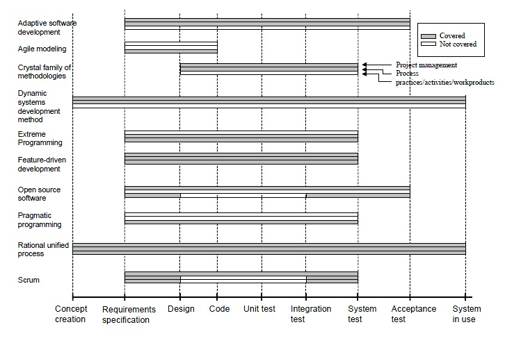

# 我们是如何把敏捷方法这样的金箍棒用成了搅屎棍的？

我想为研发人员挣得一杯咖啡的时间。

## 一、原则、价值观、哲学、技巧、最佳实践

任何负责任的作者，都不会把一本书的内容随随便便概括成几句话的。

### 1. Scrum的价值观

- 交付。团队成员在每一个迭代(Sprint)里为了完成团队目标，独立地交付结果。
- 勇气。团队成员清楚他们是有勇气一起经历相互矛盾和相互挑战，去完成正确的事情。
- 聚焦。团队成员排他性地聚焦团队目标(Goal)和迭代(Sprint)中的代办事项(Backlog)，不应该存在Backlog之外的任何其他事情在迭代内完成。
- 开放。团队成员以及利害干系人对工作上的相互透明和相互挑战保持认可的心态。
- 尊重。团队成员之间对彼此的胜任能力、对意图正邪的肯定上互相尊重。

### 2. AUP的哲学

- 你的伙计们知道他们正在干什么。他们不会去阅读详细文档，但是他们想要实时的高层次的引导。
- 简单。所有事情简单明了地描述在能够拿在手上的几张纸上，而不是几千页那种。
- 灵活。灵活是敏捷方法价值和原则的保障。
- 把焦点放在高价值的行动上。把焦点放在明确的几个行动上，而不是让项目尽可能覆盖所有可能性。
- 与工具无关。只要是最适合的，你可以使用任何工具的集合去完成你的工作。
- 你可以根据你的实际需要裁剪AUP方法中的内容。

### 3. 编写良好的用户故事的10个技巧

- **用户优先**。
- 利用角色模型发现正确的用户故事。
- **以协作的方式创建用户故事**。
- 保持用户故事简单明了。
- 用史诗般的叙事方式开始。
- **精炼提纯用户故事，直至它准备就绪**。
- 对于用户故事的完成，添加可接受的条件。
- 使用纸质卡片
- 保持用户故事看得见，并且触手可得。
- **不要让故事依赖另一个故事**。

### 4. 用户故事的最佳实践-INVEST

- **I**ndependent。互不依赖。确保我们可以按任何优先顺序进行开发。
- **N**egotiable。可协商。避免过早定义实现细节，来保持故事实现上的灵活性。这样团队就能对实现方案或者故事完成到什么程度进行调整。
- **V**aluable。有价值。用户或者客户从完成的故事中收益。
- **E**stimable。可度量。只有可度量，才能够做计划。
- **S**mall。小。很大的故事难以预估投入资源和做计划。
- **T**estable。可测。对于完成设置可接受的条件，或者明确“完成”的定义，以便编写测试用例。

### 5. 用户故事模版

As a &lt;type of user&gt;, I want &lt;some goal&gt;, so that &lt;some reason&gt;.

## 二、之所以是轻量级方法，不是因为你可以把**你不喜欢**的，**你觉得没用**的去掉。
它的重点一直都是**灵活应对变化**。

### 软件工程是以技术人员的劳动作为核心生产力的庞大的系统工程。

