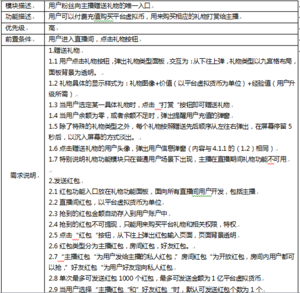

## 引言
>软件工程是以技术人员为核心的生产活动

在这里推荐一本书(<small>感谢[未舟](http://zwiter.com/)在恰当的时间给我推荐这本书</small>):

>[《大象：Thinking in UML(第2版)》](https://book.douban.com/subject/10549583/)

当然你也可以不看，因为我接下来就是要提炼问题的核心。

UML是软件工程中最为直接高效的文档形式，尤其是面向技术人员，可以精准地指导具体的技术实现。
但实际软件工程项目过程中，由于很多需要解决的问题不是技术问题，所以软件工程中很大比例的工作人员是非技术人员。

如果你了解过RUP，那你一定知道Rational公司推出的RUP方法也是众多重量级方法中最拔尖的那一个。
这个公司的Rational Rose这个UML工具产品，基本上也可以秒杀市面上所有的UML工具。

>[RUP (Rational Unified Process](https://en.wikipedia.org/wiki/Rational_Unified_Process))

早些年参与工作的工程师们接触的形形色色的方法，其实你都可以理解为是类RUP的方法。

我想引用几个这本书里边提及的的部分所谓的非技术性文档，结合着我自己收集的UML视图，向大家呈现这种重量级方法。

它们可能真的会比较无聊，阅览它们甚至会非常难受，但你不要以为你错了，它们本来就是那样的，错的不是你。
幸运的是这个系列的文章不是讲解重量级方法，你只需要通过快速扫过感受一下它们在工程中的意义就足够了。

图例可能和你正在使用的Visio、Eclipse等UML工具有些差异，但不要紧，因为同一抽象的视图的作用是一样的。

## 所谓的非技术性文档

### 需求文档中涉及到交互
这种大多数人都见过，需求文档中涉及到交互的部分。

111111111111111111111111

这是我在[《移动直播App：直播间功能需求文档》](http://www.kejik.com/article/149091.html)这篇文章中摘的图片。
感兴趣的话你也可以去看看。

### 《大象：Thinking in UML(第2版)》中的文档
#### 涉众概要文档

#### 用例（自然人）
RUP中用例的概念比较宽泛，主要指和系统或者模块打交道的角色。
而这个角色有可能是自然人，有可能是其他模块或者系统

#### 用例规约

#### 非功能性需求

#### 非功能性需求可靠性

#### 非功能性需求有效性

## UML

### UML概要
UML视图可以分为两大类

>结构视图(Structure Diagrams)，也叫静态视图(Static Diagrams)。
>行为视图(Behavior Diagrams)，也叫动态视图(Dynamic Diagrams)。

### 结构视图 (Structure Diagrams)
#### 类图(Class Diagrams)

#### 对象图(Object Diagrams)

#### 包图(Package Diagrams)

#### 模型图(Model Diagrams)

#### 集成图(Composite Diagrams)

#### 组件图(Component Diagrams)

#### 实现图(Manifestation Diagrams)

#### 部署图(Deployment Diagrams)

#### 网络架构图(Network Architecture Diagrams)

#### 配置图(Profile Diagrams)

### 行为视图 (Behavior Diagrams)
#### 用例图(UseCase Diagram)

#### 活动图(Activity Diagram)

#### 状态图(State Machine Diagram)

#### 交互图(Interaction Overview Diagram)

#### 序列图(Sequence Diagram)

#### 通信图(Communication Diagram)

#### 计时图(Timing Diagram)

## 完美的结局
它们可以覆盖工程的方方面面，保证滴水不漏。

只要那些担当工程各个阶段和领域的负责人的能力和道德是符合要求的(这一点可以通过严格的招聘流程保证)，
只要严格遵守方法论的标准和要求，
就本应该可以达到预期的目标，并且结局本应该也是完美的。

## 残酷的现实
然而，现实总是打脸的。

>1. 整个项目工期比预计要长。
>2. 投入的资源比预计要大。
>3. 客户揪着不符合自己预期的实现，一再推拖余款的支付，甚至可能会打官司。
>4. 领导也不满意。

## 雪上加霜
互联网技术的爆发给这样的重量级方法增添了更多的变量。

>1. 变化太多、太快，导致需求不断地被修改。
>2. 随之，人力和时间成为新的瓶颈。

这些变量导致重量级方法在这个行业一而再，再而三地酝酿出一个个悲剧。
然后企业或者团队慢慢走向死亡，最终消失在茫茫的互联网海洋的水平面下。

到此，我觉得差不多也到了推荐另一本书的时候了。
>[《人月神话》](https://book.douban.com/subject/1102259/)
