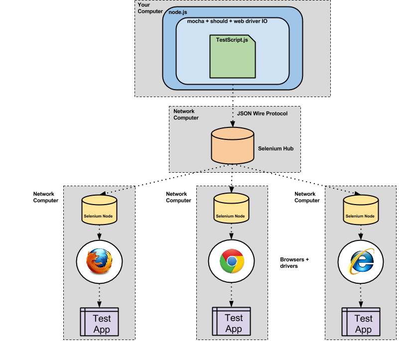

[返回首页](../README.md)

# Selenium, Protractor, Karma

## 工作原理


## 远程服务器
1. 因为要使用jar文件，所以得有java环境。
2. 到[SeleniumHQ官网](http://www.seleniumhq.org/download/)下载`Selenium Standalone Server`和。
3. 到[SeleniumHQ官网](http://www.seleniumhq.org/download/)下载`Google Chrome Driver`。
4. 然后执行命令
```bash
$ /usr/bin/java \
-Dwebdriver.chrome.driver=/any/where/chromedriver \
-jar /any/where/selenium-server-standalone-2.48.2.jar
```

## Protractor(e2e)
```javascript
// file: package.json
...
"devDependencies": {
    ...
    "karma-webdriver-launcher": "^1.0.4",
    ...
},
...
```

```javascript
// file: protractor-conf.js
...
directConnect: false,
seleniumAddress: 'http://192.168.56.1:4444/wd/hub', // selenium gird服务器IP
baseUrl: 'http://192.168.56.105:8000/', // 站点地址
...
```

## Karmar

```javascript
// file: karma.conf.js
var webdriverConfig = {
    hostname: '192.168.56.1', // selenium grid服务器IP
    port: 4444,
};
...
config.set({
    ...
    hostname: '192.168.56.105', // karma服务器IP
    port: 9876,
    ...
    customLaunchers: {
        'remoteosxchrome': {
            base: 'WebDriver',
            config: webdriverConfig,
            browserName: 'chrome',
            platform: 'OS X',
            version: '46.0',
        }
    },
    ...
    browsers : ['remoteosxchrome'],
    ...
    plugins : [
        ...
        'karma-webdriver-launcher',
        ...
    ],
    ...
});
```
