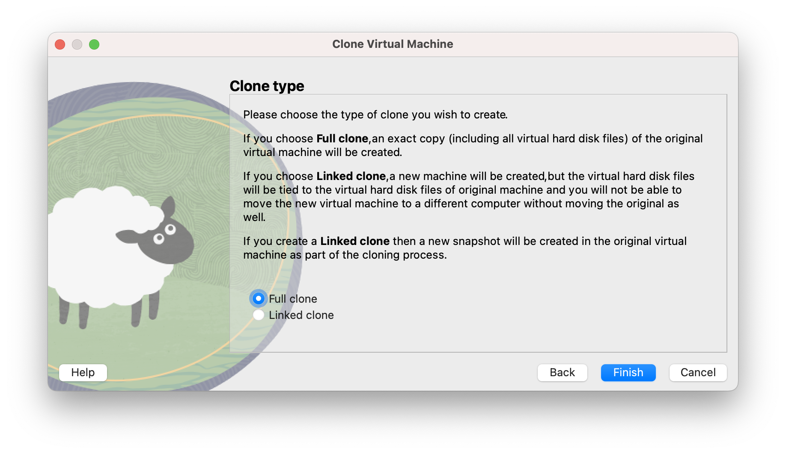
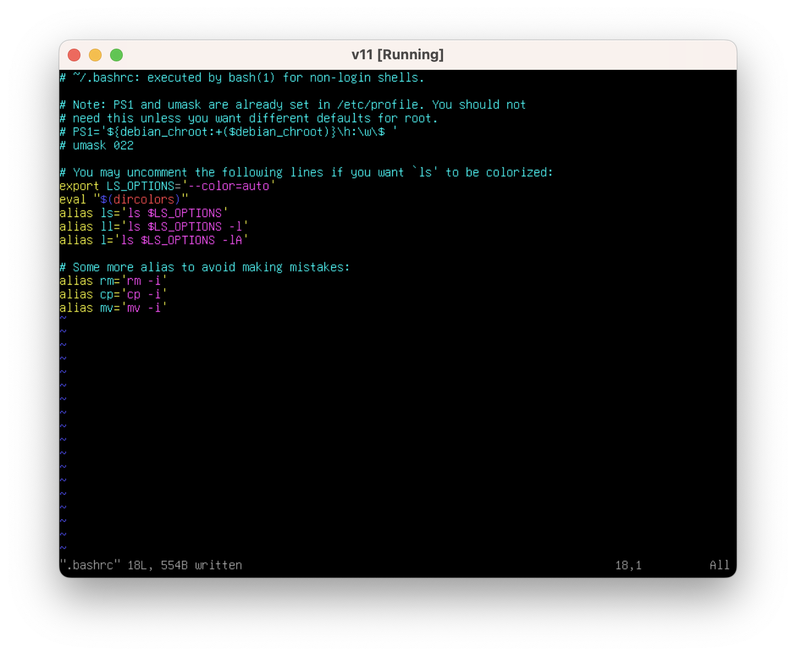
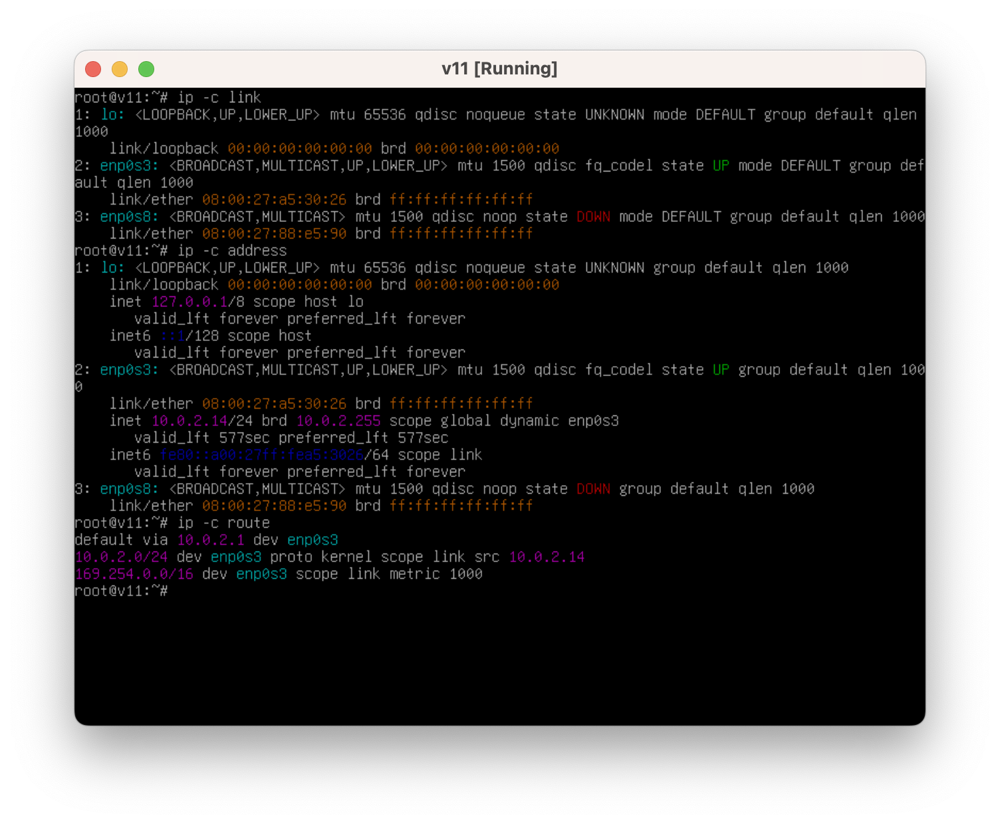
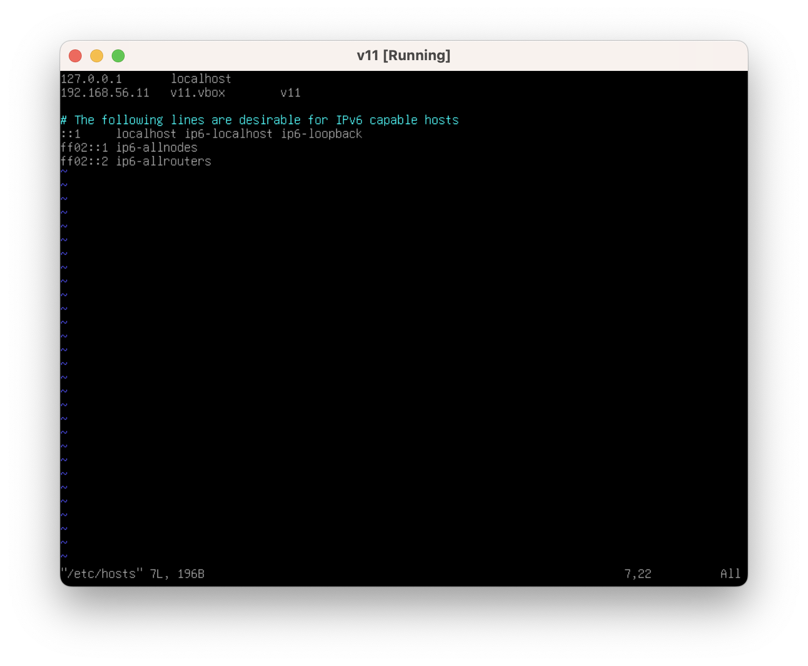

[返回首页](../../README.md)

# 初始化试验用虚拟机

我们会使用[《最小化安装Debian12》](../virtualbox-minium-debian12/index.md)中准备好的种子虚拟机。

<!-- markdown-toc start - Don't edit this section. Run M-x markdown-toc-refresh-toc -->
**Table of Contents**

- [初始化试验用虚拟机](#初始化试验用虚拟机)
    - [克隆全新的虚拟机](#克隆全新的虚拟机)
    - [新增Host-only网络适配器](#新增host-only网络适配器)
    - [账号配置](#账号配置)
    - [网络配置](#网络配置)
    - [主机名及其映射IP](#主机名及其映射ip)
    - [验证网络通信](#验证网络通信)

<!-- markdown-toc end -->


## 克隆全新的虚拟机

需要注意，一定要为复制的虚拟机生成全新的网卡地址。




## 新增Host-only网络适配器

[VirtualBox中各种网络模式的区别](https://www.virtualbox.org/manual/UserManual.html#networkingmodes)

种子虚拟机中只有默认配置的NAT Network网络，我们没有办法从宿主机（主机）访问虚拟机的。

虽然VirtualBox的虚拟机也可以直接使用，但是和通过`ssh`登陆使用相比，体验差别很大。

虽然不是唯一的理由，但为了能够使用自己喜欢的终端软件连接虚拟机，我们为虚拟机配置Host-only的网络。

为虚拟机再增加一张网卡，并为这个网卡配置Host-only的网络。


## 账号配置

启动并输入`actor`用户名密码登陆虚拟机终端。

切换到`root`账号，并修改`root`账号的`.bashrc`。

```shell
sudo -i

apt update
apt install vim

vim ~/.bashc
```

修改内容如下，主要是取消注释必要的行。



## 网络配置

查看网络基本信息。

```shell
# 查看网络设备（网卡）
ip -c link
```

- lo 本地回环接口。也就是平时使用的127.0.0.1等。
- enp0s3 第一个网卡。也就是配置了NAT Network网络的网卡。
- enp0s8 第二个网卡。接下来要配置Host-only Network网络的网卡。

```shell
# 查看IP地址
ip -c address

```

可以看到enp0s3上通过`dhcp`分配了`10.0.2.14`，enp0s8上尚未分配IP地址。

```shell
# 查看路由信息
ip -c route
```

这里`default`路由指定的IP为默认网关IP，我们在操作系统中请求网络时，网络请求所对应的数据包会发送到该IP。

`10.0.2.1`为`10.0.2.0/24`(NAT Network)网段的网关地址。



为两个网卡都分配静态IP，并设置默认网关。

即使有多个网卡，gateway只能设置一个。

其中

```shell
address 10.0.2.11/24
```

等价于

```shell
address 10.0.2.11
netmask 255.255.255.0
```

修改`/etc/network/interfaces`。

```shell
vim /etc/network/interfaces
```

内容如下。


重启网络服务，并重新查看网络相关信息。

```shell
systemctl restart networking.service

ip -c link
ip -c address
ip -c route
```


设置默认网关也可以用`ip`命令设置，只不过重启之后会丢失。

```shell
ip route add default via 10.0.2.1
```

## 主机名及其映射IP

修改主机名。

```shell
hostnamectl hostname v11.vbox

hostname
```

修改`/etc/hosts`

```shell
vim /etc/hosts
```

修改内容如下。



测试。

```shell
ping -c v11.vbox

ping -c v11 # 依赖/etc/resolv.conf中的search指令

cat /etc/resolv.conf
```


## 验证网络通信

打开宿主机（主机）的终端（Terminal)，通过ssh连接虚拟机。

```shell
ssh actor@192.168.56.11
```


如果能够成功连接，则说明我们大功告成。
