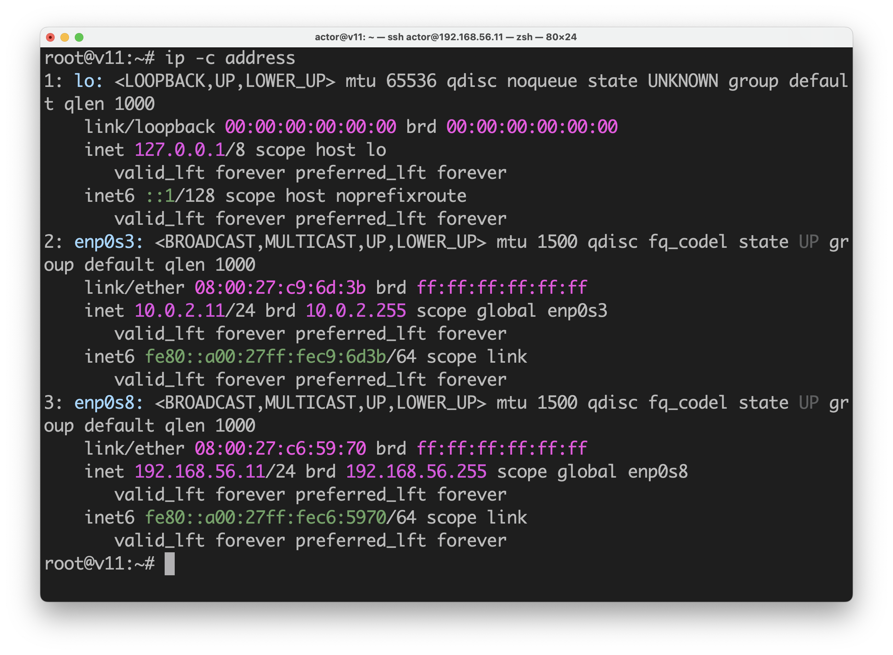
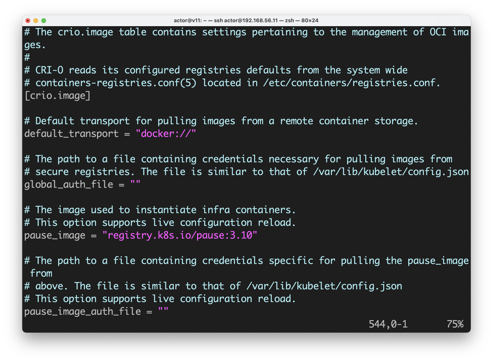
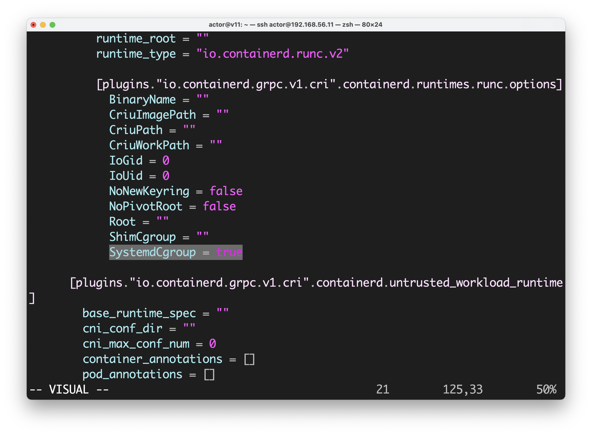
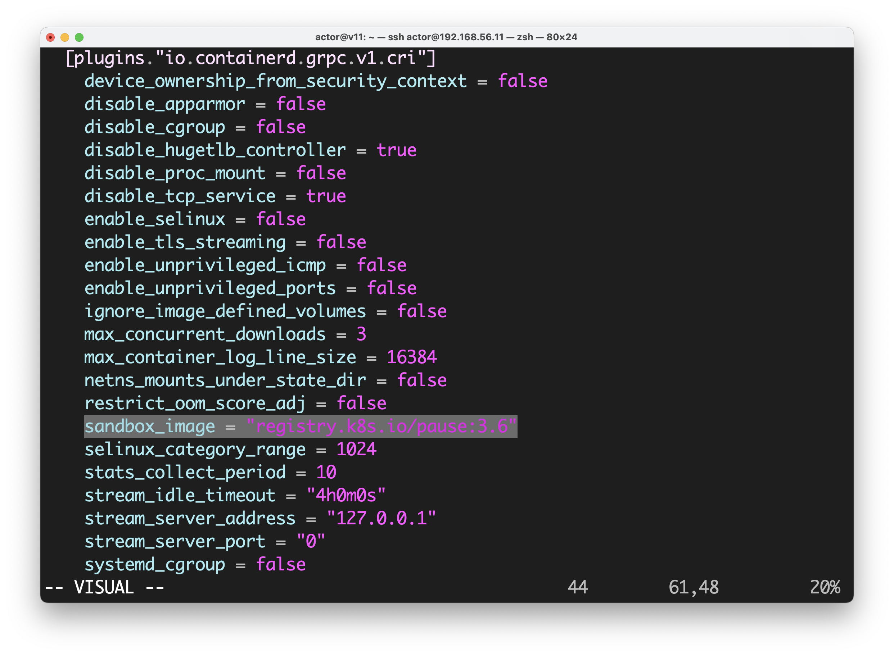
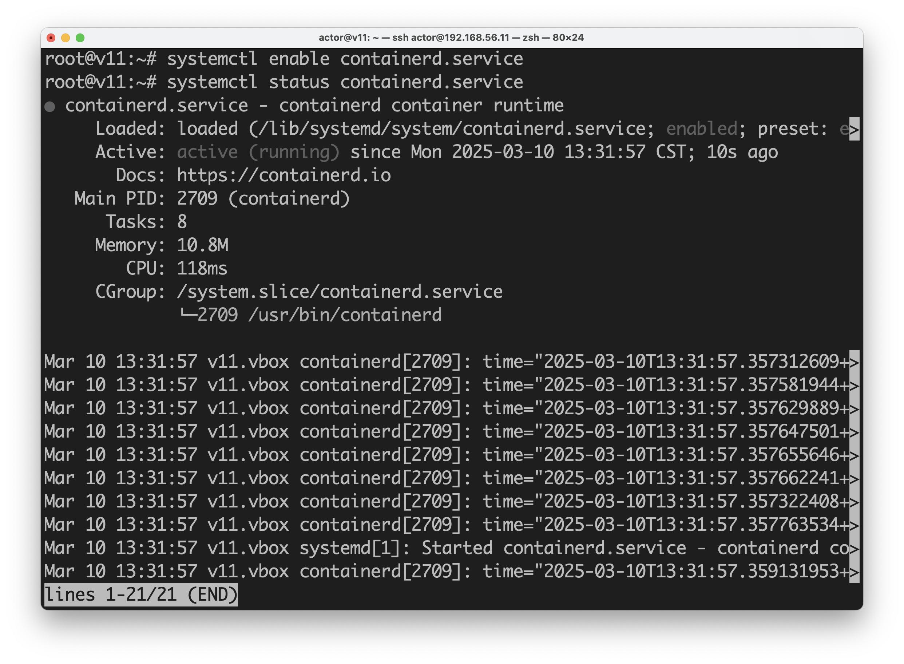
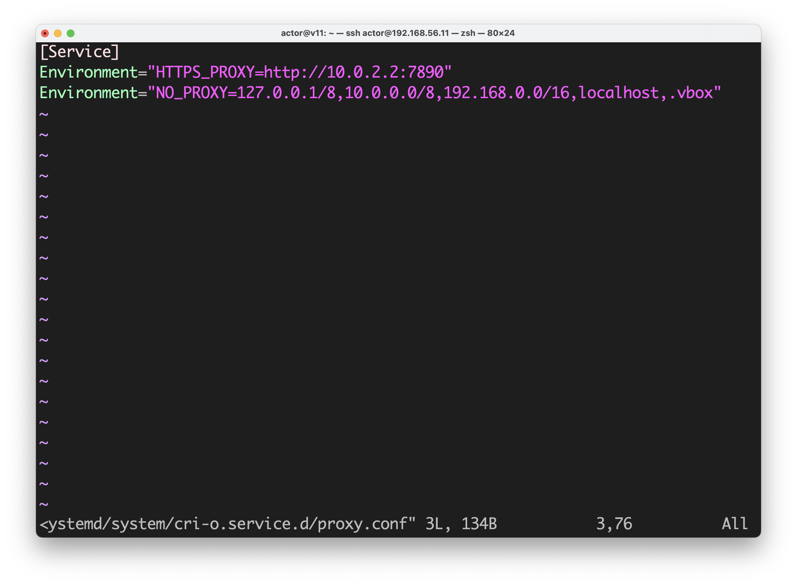
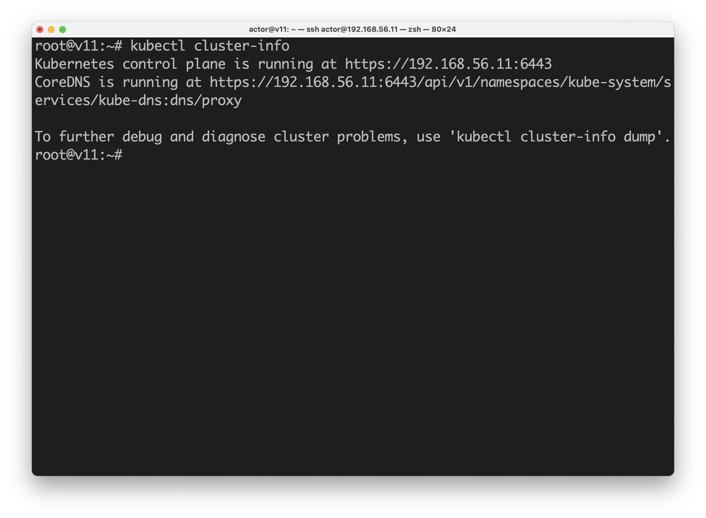
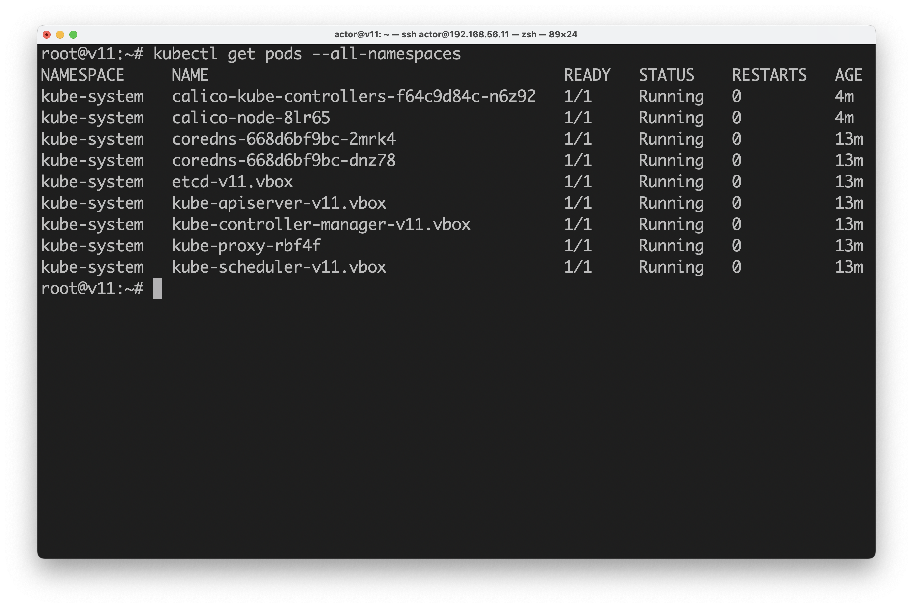

[返回首页](../../README.md)

# 搭建kubernetes集群

我们会使用通过[《初始化试验用虚拟机》](../virtualbox-clone-and-init/index.md)中的办法克隆创建的2个虚拟机。

- `v11`为`control-plain`节点
- `v12`为`worker`节点。

<!-- markdown-toc start - Don't edit this section. Run M-x markdown-toc-refresh-toc -->
**Table of Contents**

- [搭建kubernetes集群](#kubernetes)
  - [检查主机名、路由、IP](#ip)
  - [开启系统内核模块](#)
  - [关闭swap](#swap)
    - [关闭swap](#swap-1)
    - [禁止挂载swap分区](#swap)
  - [设置系统全局代理](#)
  - [设置`apt`的代理](#apt)
  - [安装基础工具](#)
  - [安装Container Runtime（二选一）](#container-runtime)
    - [安装CRI-O（选项一）](#cri-o)
      - [添加`apt`源](#apt)
      - [安装`cri-o`](#cri-o)
      - [配置`cri-o` ](#cri-o)
      - [配置CNI bridge插件](#cni-bridge)
      - [启动服务、设置为开机启动、检查状态](#)
    - [安装containerd（选项二）](#containerd)
      - [添加`apt`源](#apt-1)
      - [安装](#)
      - [配置](#)
      - [启动服务、设置为开机启动、检查状态](#-1)
    - [Container Runtime的代理配置](#container-runtime)
  - [安装kubernetes](#kubernetes)
    - [添加`apt`源](#apt-2)
    - [安装`kubelet`, `kubeadm`, `kubectl`](#kubelet-kubeadm-kubectl)
    - [初始化`control-plane`节点](#control-plane)
    - [用户环境变量配置](#)
    - [查看集群基本信息](#)
    - [安装CNI plugin(Calico)](#cni-plugincalico)
    - [查看集群状态](#)
    - [配置`crictl`](#crictl)
  - [添加第一个`worker`节点](#worker)
    - [新的虚拟机](#)
    - [加入集群](#)
    - [检查集群状态](#)
  - [使用单机集群](#)
  - [验证](#)

<!-- markdown-toc end -->

## 检查主机名、路由、IP
```
hostname
cat /etc/hosts
ip -c route
ip -c address
```




## 开启系统内核模块

```shell
modprobe overlay
modprobe br_netfilter
```

```shell
cat <<EOF | tee /etc/modules-load.d/k8s.conf
overlay
br_netfilter
EOF
```

```shell
cat <<EOF | tee /etc/sysctl.d/99-k8s-cri.conf
net.bridge.bridge-nf-call-iptables = 1
net.bridge.bridge-nf-call-ip6tables = 1
net.ipv4.ip_forward = 1
EOF
```

```shell
sysctl --system
```


## 关闭swap

### 关闭swap

```shell
swapoff -a
```

### 禁止挂载swap分区

```shell
sed -i '/UUID\(.*\) swap / s/^\(.*\)$/# \1/g' /etc/fstab
```

或者

```shell
vim /etc/fstab
```

找到swap分区并注释掉。


修改后的`/etc/fstab`如下。


## 设置系统全局代理

安装过程中有不少需要代理访问。

代理配置写到`.bashrc`文件中，以便下次登陆时也生效。

```shell
export https_proxy="http://10.0.2.2:7890"
export no_proxy="127.0.0.1/8,10.0.0.0/8,192.168.0.0/16,localhost,.vbox"

vim ~/.bashrc
```


## 设置`apt`的代理

```shell
echo 'Acquire::HTTPS::proxy "http://10.0.2.2:7890";' > /etc/apt/apt.conf.d/90proxy.conf
```


更新软件包索引。

```shell
apt update
```

## 安装基础工具
```shell
apt install curl gnupg 
```

## 安装Container Runtime（二选一）
[k8s官方文档](https://kubernetes.io/docs/setup/production-environment/container-runtimes/)

- CRI-O
- containerd


### 安装CRI-O（选项一）

[CRI-O官方文档](https://github.com/cri-o/packaging/blob/main/README.md)
中是一口气安装`k8s`和`CRI-O`。

因为要
[k8s官方文档](https://kubernetes.io/docs/setup/production-environment/tools/kubeadm/install-kubeadm/)优先，
所以只安装`cri-o`。

#### 添加`apt`源

```shell
export CRIO_VERSION=v1.32

curl -fsSL https://download.opensuse.org/repositories/isv:/cri-o:/stable:/$CRIO_VERSION/deb/Release.key |
    gpg --dearmor -o /etc/apt/keyrings/cri-o-apt-keyring.gpg

echo "deb [signed-by=/etc/apt/keyrings/cri-o-apt-keyring.gpg] https://download.opensuse.org/repositories/isv:/cri-o:/stable:/$CRIO_VERSION/deb/ /" |
    tee /etc/apt/sources.list.d/cri-o.list
    
apt update
```


#### 安装`cri-o`

```
apt install cri-o
```

#### 配置`cri-o` 

新版本的`cri-o`在Debian系统中不创建默认的配置文件。

用默认配置生成一个配置文件。

```shell
crio config --default > /etc/crio/crio.conf
```


从输出内容中配置文件的加载顺序可以得知，自定义配置可以放到`/etc/crio/crio.conf.d/`目录中。

打开配置文件并检查，

```shell
vim /etc/crio/crio.conf
```

确保`[crio.network]`段中，`network_dir`和`plugin_dir`，是未被注释的。


确保`[crio.image]`段中，`pause_image`未被注释。



#### 配置CNI bridge插件

`cri-o`自带的`bridge`插件的配置默认是禁用的。

复制一份开启的

```shell
cp /etc/cni/net.d/10-crio-bridge.conflist.disabled /etc/cni/net.d/10-crio-bridge.conflist

cat /etc/cni/net.d/10-crio-bridge.conflist
```

我们使用默认的`subnet`, `10.85.0.0/16`。


#### 启动服务、设置为开机启动、检查状态

```shell
systemctl restart crio.service
systemctl enable crio.service 
systemctl status crio.service
```


### 安装containerd（选项二）

[官方安装文档](https://github.com/containerd/containerd/blob/main/docs/getting-started.md)

Debian的需要从Docker仓库安装。

[Docker官方文档](https://docs.docker.com/engine/install/debian/)

#### 添加`apt`源

```shell
curl -fsSL https://download.docker.com/linux/debian/gpg -o /etc/apt/keyrings/docker.asc

echo \
  "deb [arch=$(dpkg --print-architecture) signed-by=/etc/apt/keyrings/docker.asc] https://download.docker.com/linux/debian \
  $(. /etc/os-release && echo "$VERSION_CODENAME") stable" | \
  sudo tee /etc/apt/sources.list.d/docker.list
  
apt update
```

#### 安装

```shell
apt install containerd
```

#### 配置
apt安装的containerd的配置文件内容很少，并且没有Cgroup驱动相关的选项。

用containerd的默认配置覆盖`/etc/containerd/config.toml`，并修改。

```shell
containerd config default > /etc/containerd/config.toml 

vim /etc/containerd/config.toml
```

找到`[plugins."io.containerd.grpc.v1.cri".containerd.runtimes.runc.options]`段，
`SystemdCgroup`的值修改为`true`。



找到`[plugins."io.containerd.grpc.v1.cri"]`段，检查`sandbox_image`的值。



#### 启动服务、设置为开机启动、检查状态

```shell
systemctl restart containerd.service
systemctl enable containerd.service 
systemctl status containerd.service
```



### Container Runtime的代理配置

在使用`systemd`管理的系统中，
`kubeadm`会通过`systemd`启动的`Container Runtime`的服务从网络下载镜像。

`systemd`默认是不会读取`shell`的环境变量，包括我们设置的代理配置。

我们在`shell`环境中设置的代理配置，无法让`kubeadm`顺利拉取初始化所需要的镜像。

相关的issue链接：

（虽然issue中提到的是`containerd`，`crio`同样存在问题）

- [https://github.com/kubernetes/website/issues/33770](https://github.com/kubernetes/website/issues/33770)
- [https://github.com/kubernetes/kubeadm/issues/182#issuecomment-1137419094](https://github.com/kubernetes/kubeadm/issues/182#issuecomment-1137419094)
- [https://github.com/kubernetes-sigs/kind/issues/688](https://github.com/kubernetes-sigs/kind/issues/688)

Docker官方文档中也有通过systemd的服务配置文件为docker进程设置环境变量的方法。

[Configure the Docker daemon to use a proxy server](https://docs.docker.com/config/daemon/systemd/#httphttps-proxy)

根据进一步查到的`systemd`的资料表明，这样的行为是`systemd`有意所为。

虽然有为`systemd`全局设置环境变量的方法，但这里选择分别针对需要代理配置的服务设置环境变量。

通常，通过`systemctl enable <服务名>.service`命令允许开启启动之后，
在`/etc/systemd/system`目录下都会创建服务配置文件的软连接。

- `crio`会创建`/etc/systemd/system/cri-o.service`软链接。
- `containerd`不会创建。

根据服务名，为指定服务创建配置目录，并创建代理配置文件。

文件名其实无所谓是什么。

`<NAME>.service`服务启动的时候，会加载`<NAME>.service.d`目录下的所有配置文件。

```shell
mkdir -p /etc/systemd/system/cri-o.service.d

touch /etc/systemd/system/cri-o.service.d/proxy.conf
```

或

```shell
mkdir -p /etc/systemd/system/containerd.service.d

touch /etc/systemd/system/containerd.service.d/proxy.conf
```

在`proxy.conf`文件中，填写以下内容。

```shell
[Service]
Environment="HTTPS_PROXY=http://10.0.2.2:7890"
Environment="NO_PROXY=127.0.0.1/8,10.0.0.0/8,192.168.0.0/16,localhost,.vbox"
```



重新加载`systemd`配置。

```shell
systemctl daemon-reload
```

重启服务

```shell
systemctl restart crio.service 

# 或

systemctl restart containerd.service
```


## 安装kubernetes

### 添加`apt`源

```shell
curl -fsSL https://pkgs.k8s.io/core:/stable:/v1.32/deb/Release.key | gpg --dearmor -o /etc/apt/keyrings/kubernetes-apt-keyring.gpg

echo 'deb [signed-by=/etc/apt/keyrings/kubernetes-apt-keyring.gpg] https://pkgs.k8s.io/core:/stable:/v1.32/deb/ /' | sudo tee /etc/apt/sources.list.d/kubernetes.list

apt update
```


### 安装`kubelet`, `kubeadm`, `kubectl`

```shell
apt install kubelet kubeadm kubectl

# 锁住版本
apt-mark hold kubelet kubeadm kubectl 
```

### 初始化`control-plane`节点

```shell
# 如果系统中确认只存在一个Container Runtime，可以不指定--cri-socket。

kubeadm init \
    --apiserver-advertise-address=192.168.56.11 \
    --pod-network-cidr=10.85.0.0/16

# 稳妥起见，最好加上--cri-socket。

kubeadm init \
    --apiserver-advertise-address=192.168.56.11 \
    --pod-network-cidr=10.85.0.0/16 \
    --cri-socket=unix:///var/run/crio/crio.sock
    
# 或

kubeadm init \
    --apiserver-advertise-address=192.168.56.11 \
    --pod-network-cidr=10.85.0.0/16 \
    --cri-socket=unix:///var/run/containerd/containerd.sock
```

这需要一点时间，最后如果看到以下信息就说明成功了。

```shell
Your Kubernetes control-plane has initialized successfully!

To start using your cluster, you need to run the following as a regular user:

  mkdir -p $HOME/.kube
  sudo cp -i /etc/kubernetes/admin.conf $HOME/.kube/config
  sudo chown $(id -u):$(id -g) $HOME/.kube/config

Alternatively, if you are the root user, you can run:

  export KUBECONFIG=/etc/kubernetes/admin.conf

You should now deploy a pod network to the cluster.
Run "kubectl apply -f [podnetwork].yaml" with one of the options listed at:
  https://kubernetes.io/docs/concepts/cluster-administration/addons/

Then you can join any number of worker nodes by running the following on each as root:

kubeadm join 192.168.56.11:6443 --token 0uzacj.081x17uwt3bya7dw \
	--discovery-token-ca-cert-hash sha256:3ab8054e739ef88b18a54224ad692836ad492f860b0d0e84c733917cb10dd44b
```


我们可以通过最后一行`join`命令把`worker`节点添加到集群中。

如果你忘记复制`join`的命令，可以使用如下命令重新生成新的`token`，并获得新的`join`命令。

```shell
kubeadm token create --print-join-command
```


### 用户环境变量配置

因为是使用root账号来管理集群，根据前一步的提示新增环境变量`KUBECONFIG`。

```shell
export KUBECONFIG=/etc/kubernetes/admin.conf
```

并且编辑root账号的`.bashrc`，以便下次登录也生效。

```shell
vim ~/.bashrc
```


### 查看集群基本信息

```shell
kubectl cluster-info
```



### 安装CNI plugin(Calico)

下载配置文件并修改
```shell
cd ~
curl -O https://raw.githubusercontent.com/projectcalico/calico/master/manifests/calico.yaml
vim calico.yaml
```

找到`CALICO_IPV4POOL_CIDR`，取消注释并修改其值与`kubeadm init`的`--pod-network-cidr`参数一致。


安装（部署）

```shell
kubectl apply -f calico.yaml
```

### 查看集群状态

```shell
kubectl get pods --all-namespaces
```

多执行几次，过一会就会看到所有的`pod`都会变成`READY`并且`RUNNING`。



### 配置`crictl`

按照[Debugging Kubernetes nodes with crictl](https://kubernetes.io/docs/tasks/debug/debug-cluster/crictl/)的说明，
为`crictl`添加配置文件`/etc/crictl.yaml`。

`cri-o`会创建该文件，内容为。

```
timeout: 0
debug: false
```

`containerd`不会创建该文件，需要自己添加。

```shell
vim /etc/crictl.yaml
```

以`crio`为例，修改内容如下

```shell
runtime-endpoint: "unix:///var/run/crio/crio.sock"
image-endpoint: "unix:///var/run/crio/crio.sock"
timeout: 0
debug: false
```


如果是`containerd`，内容如下

```shell
runtime-endpoint: "unix:///var/run/containerd/containerd.sock"
image-endpoint: "unix:///var/run/containerd/containerd.sock"
timeout: 0
debug: false
```

## 添加第一个`worker`节点

### 新的虚拟机
复制一个新的虚拟机，使用相同的方式准备环境。

**重点是要正确修改`hostname`, `/etc/hosts`, `/etc/network/interfaces`**

唯一的区别是在`worker`节点中是不需要初始化`control-plane`节点(kubeadm init）。

### 加入集群

准备好之后，把该节点添加到集群。

```shell
kubeadm join 192.168.56.11:6443 --token hc4yq2.f4zgmsakcjt2gto2 --discovery-token-ca-cert-hash sha256:145db387bebd548da8133774513f8bd88e798e4cdc190bd0a9ef515b9d1f8710
```


### 检查集群状态

返回`control-plane`节点检查集群状态

```shell
kubectl get pods -o wide --all-namespaces
kubectl get nodes -o wide
```

可以看到新节点已经加入集群。


## 使用单机集群

如果不想额外添加worker节点，使用单机集群。

在`control-plane`节点，执行命令。

```shell
kubectl taint nodes $(hostname) node-role.kubernetes.io/control-plane:NoSchedule-
```

会返回

```
node/$HOSTNAME untainted
```

之后就可以用kubectl部署对象。

生产环境绝对不能这样用，因为不正确的部署，可能会导致`control-plane`当机。

## 验证

选择比较轻量级的`NginX`作为验证的应用。

以此执行以下命令。

```shell
kubectl create deployment nginx --image=nginx:alpine --replicas=2
kubectl create service nodeport nginx --tcp=80:80
kubectl get pods
```

多次执行`kubectl get pods`，等待`NginX`的`Pod`状态变成`Running`

在执行以下命令获取端口。
```shell
kubectl get svc
```


在任意能够访问`192.168.56.11`的机器（宿主机或虚拟机）上，通过浏览器或者`curl`访问查到的端口。

能够访问到`NginX`的欢迎页，就说明大功告成。
