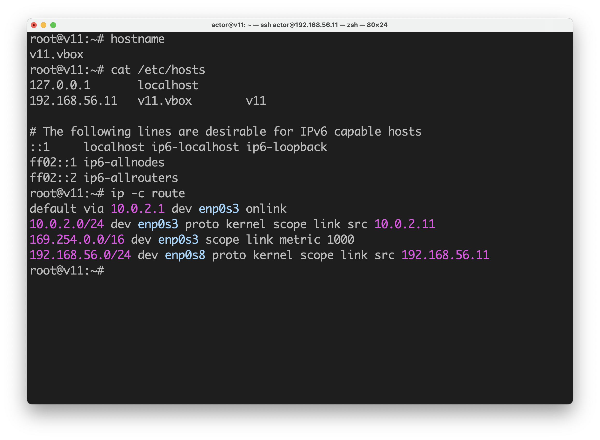
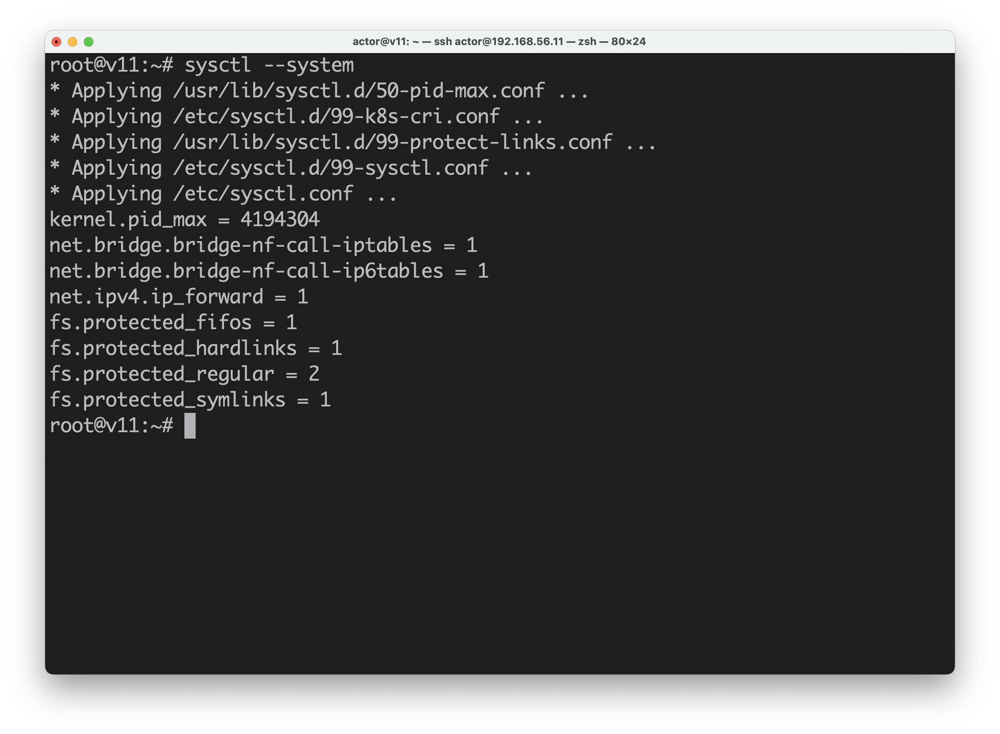
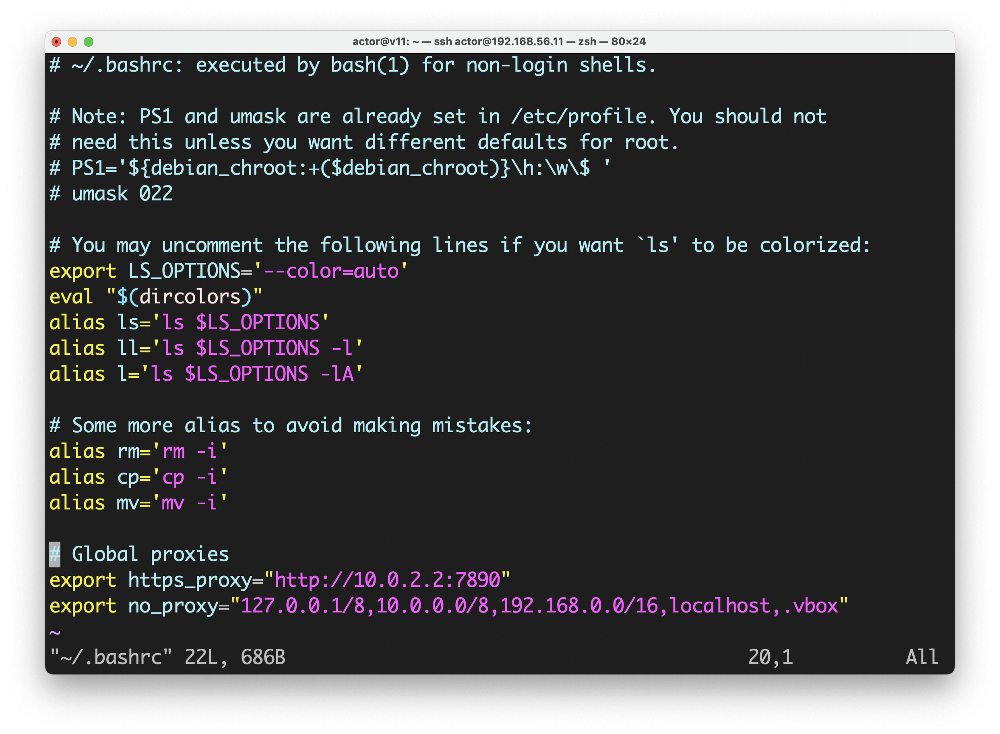
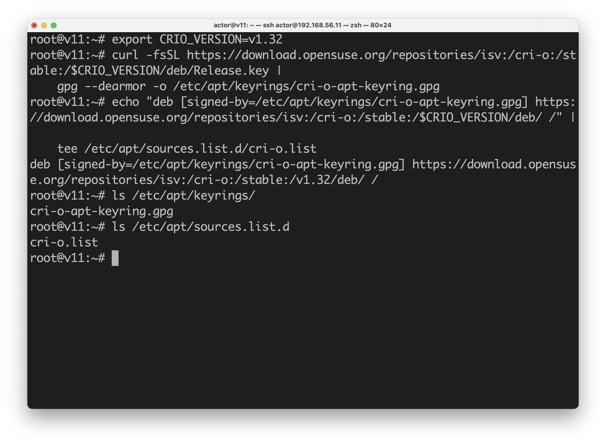
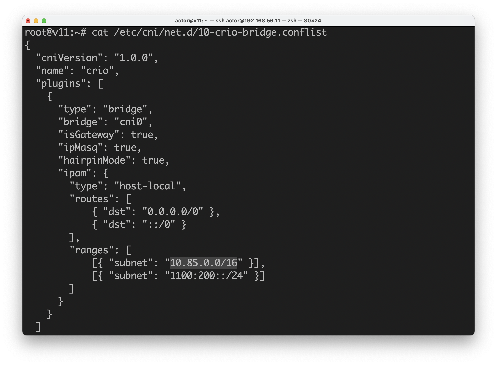
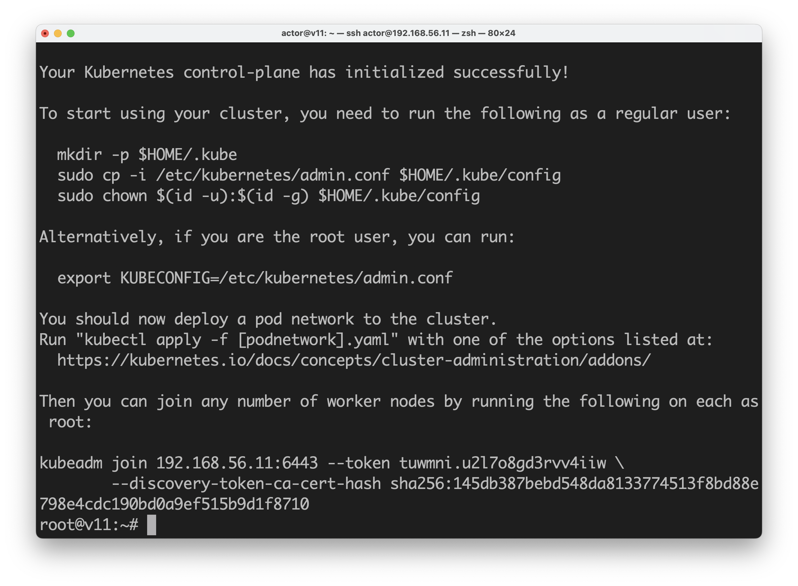
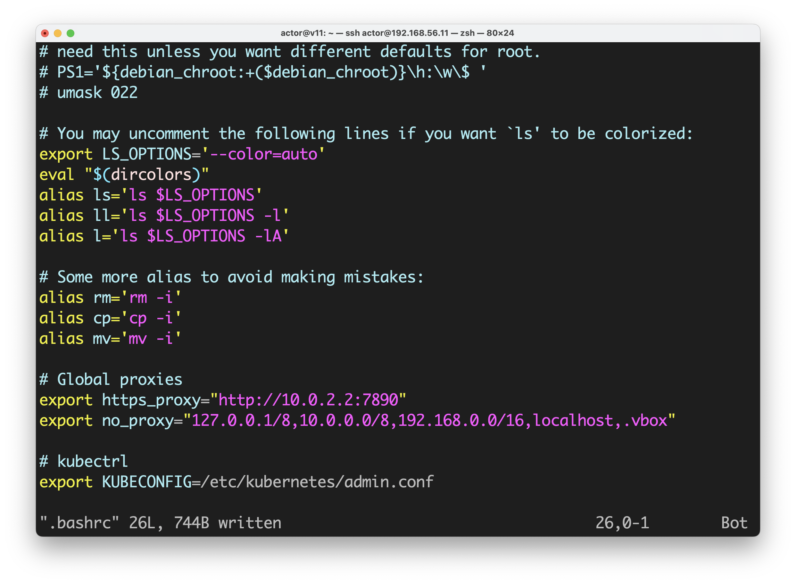

[返回首页](../../README.md)

# 搭建kubernetes集群

我们会使用通过[《初始化试验用虚拟机》](../virtualbox-clone-and-init/index.md)中的办法克隆创建的2个虚拟机。

- `v11`为`control-plain`节点
- `v12`为`worker`节点。

<!-- markdown-toc start - Don't edit this section. Run M-x markdown-toc-refresh-toc -->
**Table of Contents**

- [搭建kubernetes集群](#搭建kubernetes集群)
    - [检查主机名、路由、IP](#检查主机名路由ip)
    - [开启系统内核模块](#开启系统内核模块)
    - [关闭swap](#关闭swap)
        - [关闭swap](#关闭swap-1)
        - [禁止挂载swap分区](#禁止挂载swap分区)
    - [设置系统全局代理](#设置系统全局代理)
    - [设置`apt`的代理](#设置apt的代理)
    - [安装基础工具](#安装基础工具)
    - [安装Container Runtime（二选一）](#安装container-runtime二选一)
        - [安装CRI-O（选项一）](#安装cri-o选项一)
            - [设置安装需要的环境变量。](#设置安装需要的环境变量)
            - [为`apt`添加`cri-o-runc`和`cri-o`的源。](#为apt添加cri-o-runc和cri-o的源)
            - [安装`cri-o`, `cri-o-runc`, `cri-tools`](#安装cri-o-cri-o-runc-cri-tools)
            - [配置](#配置)
            - [启动并设置为开机启动](#启动并设置为开机启动)
            - [检查状态](#检查状态)
        - [安装containerd（选项二）](#安装containerd选项二)
            - [安装](#安装)
            - [配置](#配置-1)
            - [启动并设置为开机启动](#启动并设置为开机启动-1)
            - [检查状态](#检查状态-1)
        - [注意事项](#注意事项)
        - [配置`crictl`](#配置crictl)
    - [安装kubernetes](#安装kubernetes)
        - [为`apt`添加Google Cloud的源](#为apt添加google-cloud的源)
        - [安装`kubelet`, `kubeadm`, `kubectl`](#安装kubelet-kubeadm-kubectl)
        - [初始化`control-plane`节点](#初始化control-plane节点)
        - [用户环境变量配置](#用户环境变量配置)
        - [查看集群基本信息](#查看集群基本信息)
        - [安装CNI plugin(Calico)](#安装cni-plugincalico)
        - [查看集群状态](#查看集群状态)
    - [添加第一个`worker`节点](#添加第一个worker节点)
        - [新的虚拟机](#新的虚拟机)
        - [加入集群](#加入集群)
        - [检查集群状态](#检查集群状态)
    - [验证](#验证)

<!-- markdown-toc end -->

## 检查主机名、路由、IP
```
hostname
cat /etc/hosts
ip -c route
ip -c address
```




## 开启系统内核模块

```shell
modprobe overlay
modprobe br_netfilter
```

```shell
cat <<EOF | tee /etc/modules-load.d/k8s.conf
overlay
br_netfilter
EOF
```

```shell
cat <<EOF | tee /etc/sysctl.d/99-k8s-cri.conf
net.bridge.bridge-nf-call-iptables = 1
net.bridge.bridge-nf-call-ip6tables = 1
net.ipv4.ip_forward = 1
EOF
```

```shell
sysctl --system
```



## 关闭swap

### 关闭swap

```shell
swapoff -a
```

### 禁止挂载swap分区

```shell
sed -i '/UUID\(.*\) swap / s/^\(.*\)$/# \1/g' /etc/fstab
```

或者

```shell
vim /etc/fstab
```

找到swap分区并注释掉。


修改后的`/etc/fstab`如下。


## 设置系统全局代理

接下来的安装过程中，会使用curl下载Google Cloud源的apt-key。

除此之外，向本地网络的请求不得请求代理服务器，否则不少`k8s`的命令都会失败。

另外把该代理配置写入到`root`的`.bashrc`文件中，以便下次登陆时也生效。

```shell
export https_proxy="http://10.0.2.2:7890"
export no_proxy="127.0.0.1/8,10.0.0.0/8,192.168.0.0/16,localhost,.vbox"

vim ~/.bashrc
```



## 设置`apt`的代理

```shell
vim /etc/apt/apt.conf.d/90proxy.conf
```

添加以下内容。

```shell
Acquire::HTTPS::proxy "http://10.0.2.2:7890";
```


更新软件包索引。

```shell
apt update
```

## 安装基础工具
```shell
apt install curl gnupg 
```

## 安装Container Runtime（二选一）

- CRI-O
- containerd


### 安装CRI-O（选项一）

#### 设置安装需要的环境变量。

在编写这片文章的时刻，CRI-O的源地址还没有Debian12的，只有Debian11的。

```shell
export OS=Debian_11
export VERSION=1.27
```

#### 为`apt`添加`cri-o-runc`和`cri-o`的源。

```shell
curl -L https://download.opensuse.org/repositories/devel:/kubic:/libcontainers:/stable/$OS/Release.key | gpg --dearmor -o /etc/apt/keyrings/libcontainers-archive-keyring.gpg
curl -L https://download.opensuse.org/repositories/devel:/kubic:/libcontainers:/stable:/cri-o:/$VERSION/$OS/Release.key | gpg --dearmor -o /etc/apt/keyrings/libcontainers-crio-archive-keyring.gpg
```

```shell
echo "deb [signed-by=/etc/apt/keyrings/libcontainers-archive-keyring.gpg] https://download.opensuse.org/repositories/devel:/kubic:/libcontainers:/stable/$OS/ /" > /etc/apt/sources.list.d/devel:kubic:libcontainers:stable.list
echo "deb [signed-by=/etc/apt/keyrings/libcontainers-crio-archive-keyring.gpg] https://download.opensuse.org/repositories/devel:/kubic:/libcontainers:/stable:/cri-o:/$VERSION/$OS/ /" > /etc/apt/sources.list.d/devel:kubic:libcontainers:stable:cri-o:$VERSION.list
```



#### 安装`cri-o`, `cri-o-runc`, `cri-tools`

```
apt update

apt install cri-o cri-o-runc cri-tools
```

#### 配置 

修改`/etc/crio/crio.conf`。

```shell
vim /etc/crio/crio.conf
```

在`[crio.network]`段中，找到`network_dir`和`plugin_dir`取消注释。


修改`/etc/cni/net.d/100-crio-bridge.conflist`。

```shell
vim /etc/cni/net.d/100-crio-bridge.conflist
```

找到`subnet`，将IPV4的值修改为`10.0.11.0/24`。



#### 启动并设置为开机启动

```shell
systemctl restart crio.service
systemctl enable crio.service 
```

#### 检查状态

```shell
systemctl status crio.service
```


### 安装containerd（选项二）

#### 安装

```shell
apt install containerd
```

#### 配置
apt安装的containerd的配置文件内容很少，并且我没有Cgroup驱动相关的选项。

用containerd的默认配置覆盖`/etc/containerd/config.toml`。

```shell
containerd config default > /etc/containerd/config.toml 
```


修改配置。

```
vim /etc/containerd/config.toml
```

找到`[plugins."io.containerd.grpc.v1.cri".containerd.runtimes.runc.options]`，`cgroup`驱动选择使用`systemd`，选项`SystemdCgroup`的值修改为`true`。


#### 启动并设置为开机启动

```shell
systemctl restart containerd.service
systemctl enable containerd.service 
```

#### 检查状态

```shell
systemctl status containerd.service
```


### 注意事项

在使用`systemd`管理服务的系统中，通过`kubeadm`初始化集群的时候，`kubeadm`会与通过`systemd`启动的`Container Runtime`的服务进程通信，让`Container Runtime`服务从网络下载初始化集群所需要的镜像。

或许是`kubeadm`不给`crio`或`containerd`服务进程传入正确的环境变量，或许是被`systemd`管理的服务进程不被允许使用系统全局代理，或许`crio`或`containerd`的实现有问题。

总之，即便设置了系统全局代理，kubeadm无法顺利拉取初始化所需要的镜像。

相关的issue链接：

（虽然issue中提到的是`containerd`，`crio`同样存在问题）

- [https://github.com/kubernetes/website/issues/33770](https://github.com/kubernetes/website/issues/33770)
- [https://github.com/kubernetes/kubeadm/issues/182#issuecomment-1137419094](https://github.com/kubernetes/kubeadm/issues/182#issuecomment-1137419094)
- [https://github.com/kubernetes-sigs/kind/issues/688](https://github.com/kubernetes-sigs/kind/issues/688)

Docker官方文档中也有通过systemd的服务配置文件为docker进程设置环境变量的方法。

[Configure the Docker daemon to use a proxy server](https://docs.docker.com/config/daemon/systemd/#httphttps-proxy)

具体方法如下。

通常，安装配置新的服务，并通过`systemctl enable <服务名>.service`命令允许开启启动之后，在`/etc/systemd/system`目录下都会创建服务配置文件的软连接。

- `crio`会创建`/etc/systemd/system/cri-o.service`。
- `containerd`不会创建。

根据服务名，为指定服务创建附加配置目录。

```shell
mkdir -p /etc/systemd/system/cri-o.service.d

# 或

mkdir -p /etc/systemd/system/containerd.service.d
```

创建配置文件。

文件名其实无所谓是什么，`<NAME>.service`服务启动的时候，会加载`<NAME>.service.d`目录下的所有配置文件。

```shell
vim /etc/systemd/system/cri-o.service.d/proxy.conf

# 或

vim /etc/systemd/system/containerd.service.d/proxy.conf
```

填写以下内容

```shell
[Service]
Environment="HTTPS_PROXY=http://10.0.2.2:7890"
Environment="NO_PROXY=127.0.0.1/8,10.0.0.0/8,192.168.0.0/16,localhost,.vbox"
```

保存退出。

重新加载`systemd`配置，重启服务。。

```shell
systemctl daemon-reload

systemctl restart crio.service 

# 或

systemctl restart containerd.service
```


### 配置`crictl`
安装完k8s之后，通过`crictl image list`查看镜像列表是，可能会遇到如下错误。

```shell
As the default settings are now deprecated, you should set the endpoint instead.
```

按照[Debugging Kubernetes nodes with crictl](https://kubernetes.io/docs/tasks/debug/debug-cluster/crictl/)的说明，为`crictl`添加配置文件，或修改。

`crio`完会穿件该文件，`containerd`不会。

```shell
vim /etc/crictl.yaml
```

内容如下

```shell
runtime-endpoint: "unix:///var/run/crio/crio.sock"
runtime-endpoint: "unix:///var/run/containerd/containerd.sock"
# 或
image-endpoint: "unix:///var/run/crio/crio.sock"
image-endpoint: "unix:///var/run/containerd/containerd.sock"

timeout: 10
debug: true
```

- unix:///var/run/crio/crio.sock
- unix:///var/run/containerd/containerd.sock


## 安装kubernetes

### 为`apt`添加Google Cloud的源

```shell
curl -fsSL https://packages.cloud.google.com/apt/doc/apt-key.gpg | gpg --dearmor -o /etc/apt/keyrings/kubernetes-archive-keyring.gpg
```

```shell
echo "deb [signed-by=/etc/apt/keyrings/kubernetes-archive-keyring.gpg] https://apt.kubernetes.io/ kubernetes-xenial main" | tee /etc/apt/sources.list.d/kubernetes.list
```


### 安装`kubelet`, `kubeadm`, `kubectl`

```shell
apt update
apt install kubelet kubeadm kubectl
```


### 初始化`control-plane`节点

```shell
# 如果系统中确认只存在一个Container Runtime，可以不指定--cri-socket。

kubeadm init \
    --apiserver-advertise-address=192.168.56.11 \
    --pod-network-cidr=10.0.11.0/24

# 稳妥起见，最好加上--cri-socket。

kubeadm init \
    --apiserver-advertise-address=192.168.56.11 \
    --pod-network-cidr=10.0.11.0/24 \
    --cri-socket=unix:///var/run/crio/crio.sock
    
# 或

kubeadm init \
    --apiserver-advertise-address=192.168.56.11 \
    --pod-network-cidr=10.0.11.0/24 \
    --cri-socket=unix:///var/run/containerd/containerd.sock
```

这需要一点时间，最后如果看到以下信息就说明成功了。

```shell
Your Kubernetes control-plane has initialized successfully!

To start using your cluster, you need to run the following as a regular user:

  mkdir -p $HOME/.kube
  sudo cp -i /etc/kubernetes/admin.conf $HOME/.kube/config
  sudo chown $(id -u):$(id -g) $HOME/.kube/config

Alternatively, if you are the root user, you can run:

  export KUBECONFIG=/etc/kubernetes/admin.conf

You should now deploy a pod network to the cluster.
Run "kubectl apply -f [podnetwork].yaml" with one of the options listed at:
  https://kubernetes.io/docs/concepts/cluster-administration/addons/

Then you can join any number of worker nodes by running the following on each as root:

kubeadm join 192.168.56.11:6443 --token 0uzacj.081x17uwt3bya7dw \
	--discovery-token-ca-cert-hash sha256:3ab8054e739ef88b18a54224ad692836ad492f860b0d0e84c733917cb10dd44b
```



我们可以通过最后一行`join`命令把`worker`节点添加到集群中。

如果你忘记复制`join`的命令，可以使用如下命令重新生成新的`token`，并获得新的`join`命令。

```shell
kubeadm token create --print-join-command
```


### 用户环境变量配置

因为是使用root账号来管理集群，根据前一步的提示新增环境变量`KUBECONFIG`。

```shell
export KUBECONFIG=/etc/kubernetes/admin.conf
```

并且编辑root账号的`.bashrc`，以便下次登录也生效。

```shell
vim ~/.bashrc
```



### 查看集群基本信息

```shell
kubectl cluster-info
```


### 安装CNI plugin(Calico)

下载配置文件并修改
```shell
cd ~
curl -O https://raw.githubusercontent.com/projectcalico/calico/master/manifests/calico.yaml
vim calico.yaml
```

找到`CALICO_IPV4POOL_CIDR`，取消注释并修改其值与`kubeadm init`的`--pod-network-cidr`参数一致。


安装（部署）

```shell
kubectl apply -f calico.yaml
```

### 查看集群状态

```shell
kubectl get pods --all-namespaces
```

多执行几次，过一会就会看到所有的`pod`都会变成`READY`并且`RUNNING`。


## 添加第一个`worker`节点

### 新的虚拟机
复制一个新的虚拟机，使用相同的方式准备环境。

**重点是要正确修改`hostname`, `/etc/hosts`, `/etc/network/interfaces`**

唯一的区别是在`worker`节点中是不需要初始化`control-plane`节点(kubeadm init）。

### 加入集群

准备好之后，把该节点添加到集群。

```shell
kubeadm join 192.168.56.11:6443 --token 699hup.fic8guqu7do3lrn2 --discovery-token-ca-cert-hash sha256:3ab8054e739ef88b18a54224ad692836ad492f860b0d0e84c733917cb10dd44b
```


### 检查集群状态

返回`control-plane`节点检查集群状态

```shell
kubectl get pods -o wide --all-namespaces
kubectl get nodes -o wide
```

可以看到新节点已经加入集群。


## 验证

选择比较轻量级的`NginX`作为验证的应用。

以此执行以下命令。

```shell
kubectl create deployment nginx --image=nginx:alpine --replicas=2
kubectl create service nodeport nginx --tcp=80:80
kubectl get pods
```

多次执行`kubectl get pods`，等待`NginX`的`Pod`状态变成`Running`

在执行以下命令获取端口。
```shell
kubectl get svc
```


在任意能够访问`192.168.56.11`的机器（宿主机或虚拟机）上，通过浏览器或者`curl`访问查到的端口。

能够访问到`NginX`的欢迎页，就说明大功告成。

