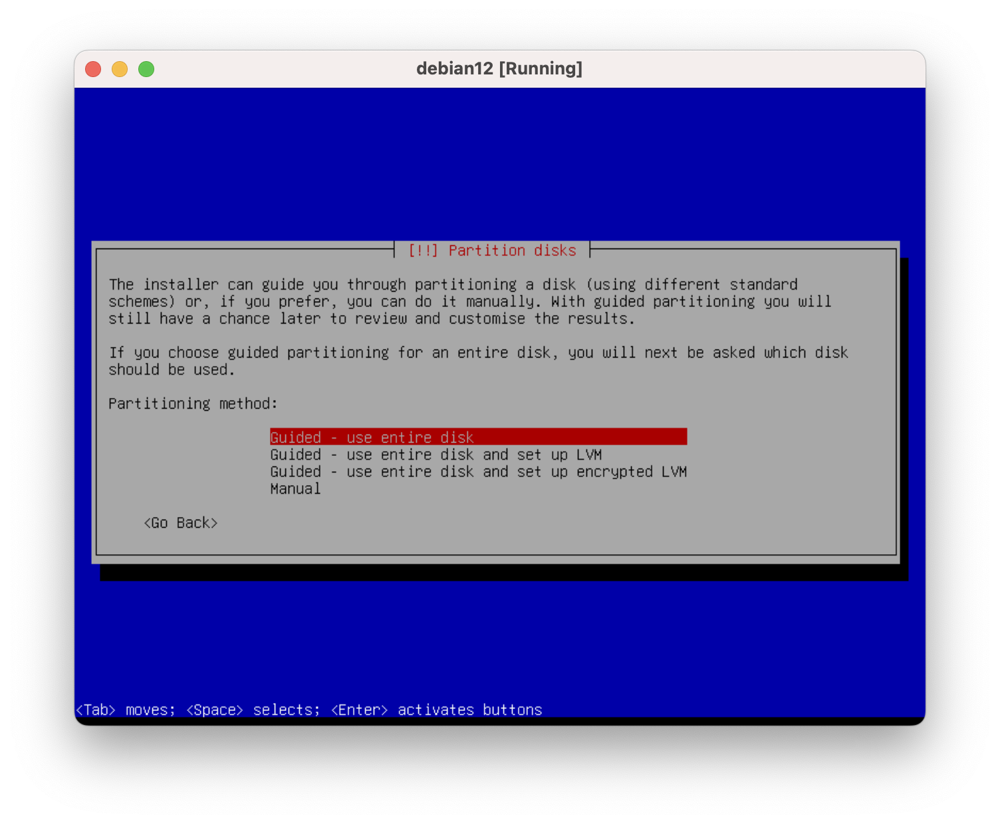
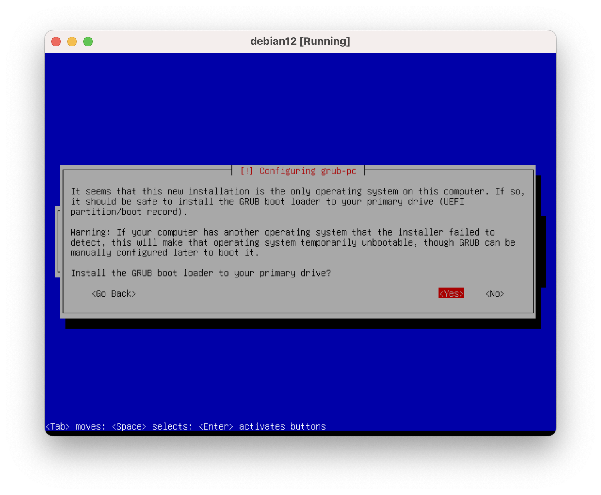

# 最小化安装Debian12

## 配置全局的NAT和Host-only的网络

[VirtualBox中各种网络模式的区别](https://www.virtualbox.org/manual/UserManual.html#networkingmodes)

配置Host-only网络，保证宿主机（主机）能够通过ssh访问虚拟机。

配置NAT Network网络，保证虚拟机能够访问外部网络。

## 创建虚拟机

跳过自动安装。

设置使用两个CPU，现在很少单核CPU。

## 配置虚拟硬件设备

设置启动设备顺序，光盘有限，硬盘其次。

不使用声卡。

第一张网卡使用全局配置的NAT网络。

## 安装操作系统

### 设置语言和地区

### 设置键盘布局

### 设置DNS和主机名

### 设置初始账号

root账号密码留空，这样会禁止使用root账号，两次确认。

设置初始账号用户名和密码。

全名留空。

设置用户名，登陆的时候使用的。

用户名和密码都设置为`actor`。

设置密码，两次确认。

### 磁盘分区

默认即可。

我们通过网络安装，无需其他媒体介质，跳过扫描。

### 软件包管理器

设置软件包镜像所在国家和域名。

如果在封闭的局域网，可以根据实际情况设置软件包安装的时候使用的代理服务器地址。

这里选择留空。

跳过上报软件包使用统计报告到开发者。

### 选择安装的软件包

这里只选择SSH服务和系统基础工具包。

这个界面也可以在安装结束之后通过`tasksel`命令重新打开并安装所需软件。

### 安装系统启动程序

选择唯一的一个磁盘。

这里是`/dev/sda`。

### 结束操作系统的安装

只有两个选项，这里选择继续，系统会自动重新启动。

等系统启动之后，直接关闭虚拟机（关机）。

虚拟机我们一般用来做实验或者当作本地开发环境来使用。

做实验的时候，可能因为误删除系统中重要的文件等原因，导致系统不可用。

虽然安装过程时间并不长，但重复多次也有可能会浪费不少时间。

所以不要再修改该虚拟机，把它当作种子来用。

这样当我们需要全新完好的最小化系统的时候，可以通过简单的复制得到，而不是又重新安装。
